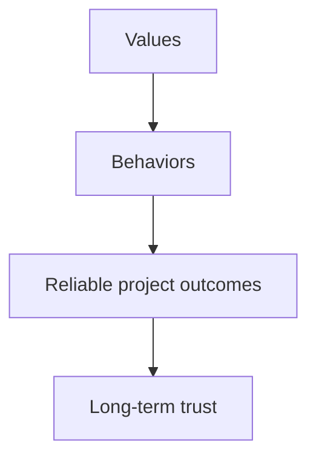

# Mission, Vision & Values

## Mission

Protect lives and property by delivering dependable fire sprinkler systems with technical excellence, safety, and integrity.

## Vision

Be the most trusted regional sprinkler subcontractor for design-build and TI execution in California.

---

## Core values

| Value | What it means in practice |
|------|----------------------------|
| Safety first | We stop unsafe work and fix conditions before proceeding |
| Craft excellence | Drawings, fabrication, and installation are done with pride |
| Accountability | We own mistakes, correct fast, and document lessons learned |
| Team over ego | Office/shop/field win together or lose together |
| Client trust | We communicate early, honestly, and with solutions |

---

## Behavioral expectations

| Role | Expected behavior |
|------|-------------------|
| PM / Office | Close loops, update risks, communicate constraints |
| Shop / Purchasing | Build and stage what field needs, when needed |
| Field leadership | Plan ahead, protect safety, own quality in place |

---

*Cross-links: [Operating cadence](/company/operations/operating-cadence) · [Onboarding](/company/onboarding/overview)*