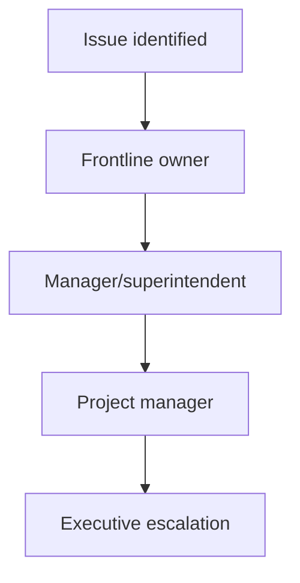

# Communication Protocol (Office-Shop-Field)

Define channels and response expectations so issues move fast without noise.

---

## Channel standards

| Channel | Use case | Response expectation |
|--------|----------|----------------------|
| Phone call | Immediate safety/production issues | Immediate |
| Teams/Chat | Same-day coordination | <= 2 hours during workday |
| Email | Formal communication, external records | <= 1 business day |
| PM platform | RFIs, submittals, issue logs | Per SLA |

---

## Escalation ladder

| Issue type | Escalate when |
|-----------|----------------|
| Safety | Immediately |
| Schedule risk | >2 day potential delay |
| Cost risk | >$5k unplanned exposure |
| Quality defect | Rework or code risk identified |

---

*Cross-links: [Team directory](/company/people/team-directory) · [Change order workflow](/processes/change-order-workflow)*