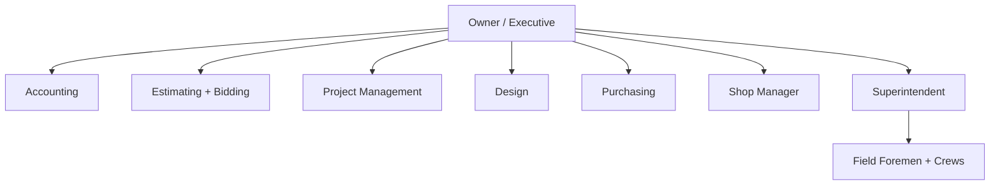

# Org Chart & Role Boundaries

Clarifies ownership and handoffs across a 30-person full-stack sprinkler subcontractor.

---

## Org structure

---

## Role boundaries (high-level)

| Role | Owns | Must coordinate with |
|------|------|----------------------|
| Estimating | Scope, labor/material pricing, risk assumptions | Bidding, PM, purchasing |
| Bidding | Proposal package, exclusions, submission | Estimating, executive |
| PM | Contract execution, schedule, COs, closeout | Design, field, accounting |
| Design | Submittals, hydraulics, drawing quality | PM, shop, field |
| Purchasing | PO strategy, lead times, vendor commitments | PM, shop, accounting |
| Shop manager | Fabrication capacity, QA release, staging | Purchasing, super, PM |
| Superintendent | Field execution, safety, quality, inspections | PM, shop, design |
| Accounting | Billing, AP/AR, job cost, close | PM, executive |

---

*Cross-links: [Project lifecycle](/processes/project-lifecycle-design-build) · [Operating cadence](/company/operations/operating-cadence)*