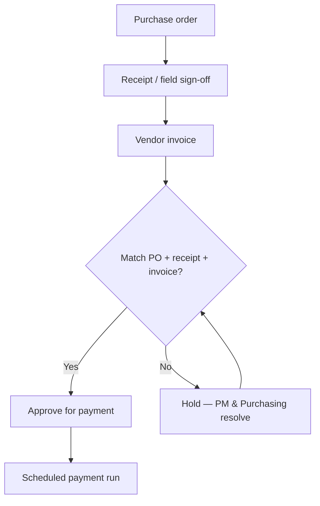

# Accounts Payable & Vendor Management

This page defines how **C-16 fire protection** work purchases flow from **approved PO** through **receipt**, **three-way match**, and **payment**, while preserving **job cost** integrity and **lien release** documentation.

---

## Live visibility — AP aging & vendor queue (Power BI)

<iframe
  title="Power BI — AP Aging by Job"
  src="https://app.powerbi.com/reportEmbed?reportId=REPLACE_AP_REPORT_ID&groupId=REPLACE_WORKSPACE_ID"
  width="100%"
  height="520"
  style="border:0;border-radius:8px;"
  loading="lazy"
  allowfullscreen>
</iframe>

---

## Policy summary

| Rule | Requirement |
|------|-------------|
| PO required | No material or subcontract invoice paid without valid PO unless **emergency buy** procedure followed |
| Receipt | Warehouse or field receipt in ERP **before** invoice approval when quantity/condition applies |
| Coding | Every line tied to **job / phase / cost type** (material, sub, equipment, other) |
| Retainage | Track **subcontract retainage** per contract; do not pay full contract value until release terms met |
| Lien docs | Conditional/unconditional waivers aligned to **progress** and **final** payments |

---

## Three-way match workflow

---

## Vendor setup checklist

| Step | Owner | Evidence |
|------|-------|----------|
| W-9 / tax ID | Accounting | Current W-9 on file |
| COI (GL, WC, umbrella) | Accounting / Risk | Matches contract minimums |
| License C-16 or valid subtrade | PM / Legal | CSLB printout or reciprocal |
| Banking / ACH | Accounting | Verified account change process |
| 1099 classification | Accounting | Vendor type in ERP |

---

## Emergency buy (after-hours)

1. **Superintendent** notifies **PM** and **Purchasing** (email/text with job # and scope).
2. Buyer issues **emergency PO** next business day **or** PM documents **written approval** trail.
3. Accounting codes to job; **no orphan expenses**.

---

## Microsoft Planner — AP exception tasks

<iframe
  title="Planner — AP holds & vendor setup"
  src="https://tasks.office.com/Home/PlanViews/REPLACE_PLANNER_PLAN_ID/Embed"
  width="100%"
  height="560"
  style="border:0;border-radius:8px;"
  loading="lazy"
  allowfullscreen>
</iframe>

---

*Cross-links: [Job costing](/departments/accounting/job-costing-and-wip) · [Retainage & liens](/departments/accounting/retainage-liens-and-releases) · [Purchasing](/departments/purchasing/overview)*
