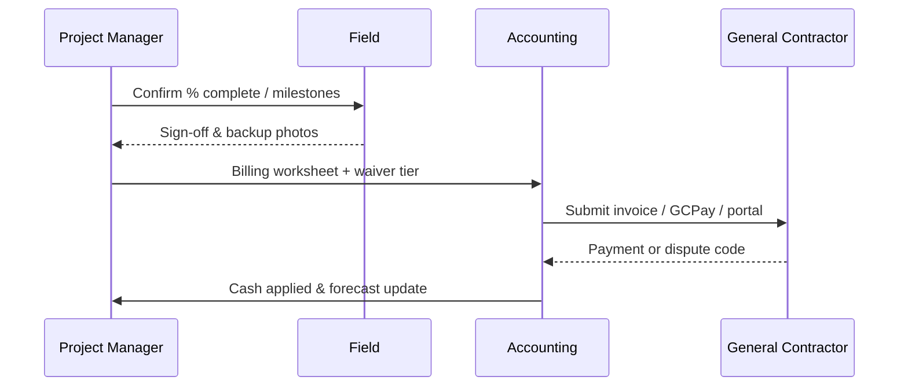

# Accounts Receivable & Progress Billing

Defines **schedule of values (SOV)**, **progress billing**, **stored materials**, **retainage billing**, and **cash application** for fire protection contracts (T&M, lump sum, and GMP).

---

## Live visibility — AR & billing pipeline (Power BI)

<iframe
  title="Power BI — Billing & AR Dashboard"
  src="https://app.powerbi.com/reportEmbed?reportId=REPLACE_AR_REPORT_ID&groupId=REPLACE_WORKSPACE_ID"
  width="100%"
  height="520"
  style="border:0;border-radius:8px;"
  loading="lazy"
  allowfullscreen>
</iframe>

---

## Billing types

| Type | When used | Controls |
|------|-----------|----------|
| Progress (AIA-style) | Most commercial GC contracts | SOV + % complete + lien waivers |
| T&M | Service / small work | Approved tickets, burden rates |
| Unit price | Tenant improvement packages | Unit tracking vs estimate |
| Final | Substantial / final completion | Punch, as-builts, warranties per contract |

---

## Progress billing cycle

---

## SOV line structure (recommended)

| SOV line | Typical content | Notes |
|----------|-----------------|-------|
| Supply & install — wet pipe | Pipe, hangers, heads (installed) | Align to estimate phases |
| Supply & install — standpipe | Vertical supply, hose valves | Separate inspection milestones |
| Backflow / FP water | Domestic tie-ins if in our scope | Coordinate with plumber |
| Fire pump | Vendor equipment + our labor | Retainage may differ |
| Testing & commissioning | Hydrostatic, flow, alarm | Often milestone bill |

---

## Retainage on invoices

- Bill **gross** then show **retainage held** per contract (typically 5–10%).
- Track **retainage receivable** separately in ERP subledger.
- Release only with **final lien waiver** package and **owner/GC** authorization.

---

## Planner — billing dates & waiver chase

<iframe
  title="Planner — Monthly billing & waivers"
  src="https://tasks.office.com/Home/PlanViews/REPLACE_PLANNER_PLAN_ID/Embed"
  width="100%"
  height="560"
  style="border:0;border-radius:8px;"
  loading="lazy"
  allowfullscreen>
</iframe>

---

*Cross-links: [Month-end close](/departments/accounting/month-end-close) · [Retainage & liens](/departments/accounting/retainage-liens-and-releases) · [Project management](/departments/project-management/overview)*
