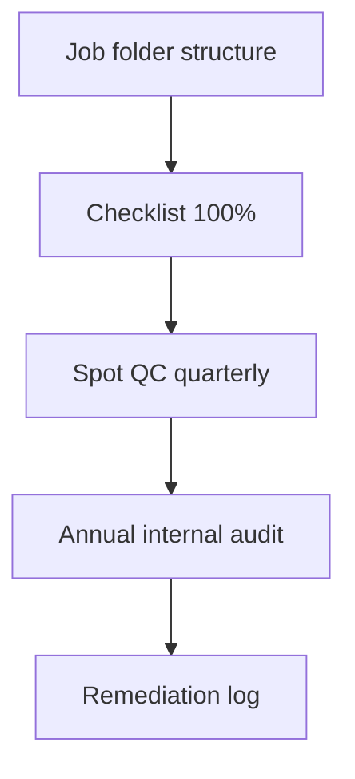

# Document Retention & Audit Readiness

Retention **schedule**, **evidence storage** (ERP, Procore, wiki, SharePoint), and **audit trail** expectations for a fire protection contractor.

---

## Live visibility — compliance completeness (Power BI)

<iframe
  title="Power BI — Document completeness by job"
  src="https://app.powerbi.com/reportEmbed?reportId=REPLACE_DOCS_REPORT_ID&groupId=REPLACE_WORKSPACE_ID"
  width="100%"
  height="480"
  style="border:0;border-radius:8px;"
  loading="lazy"
  allowfullscreen>
</iframe>

---

## Retention matrix (guideline — legal to confirm)

| Record type | Minimum retention | System of record |
|-------------|-------------------|------------------|
| Contracts & amendments | Permanent | Contract mgmt |
| Pay apps & waivers | 7+ years | ERP / PDF |
| Certified payroll | 3+ years | Time / DIR |
| Safety SDS / training | OSHA rules | Safety software |
| Submittals / RFIs | Life of building + | Project drive |
| Email approvals (COs) | Match contract | Archived mailbox |

---

## Audit readiness flow

---

## Job closeout document index (minimum)

| Document | Owner |
|----------|-------|
| As-built / BIM deliverable | Design |
| O&M / manuals | PM |
| Warranty letters | PM |
| Test reports | Field |
| Training sign-in | Safety |
| Final lien waiver | Accounting |

---

## Access controls

| Role | Access |
|------|--------|
| Field supers | Their jobs only |
| PM | Assigned + portfolio |
| Accounting | Financial tree |
| Executive | Read all |

---

## Planner — internal audit tasks

<iframe
  title="Planner — Document QC & audits"
  src="https://tasks.office.com/Home/PlanViews/REPLACE_PLANNER_PLAN_ID/Embed"
  width="100%"
  height="500"
  style="border:0;border-radius:8px;"
  loading="lazy"
  allowfullscreen>
</iframe>

---

*Cross-links: [Month-end close](/departments/accounting/month-end-close) · [Project management](/departments/project-management/overview)*
