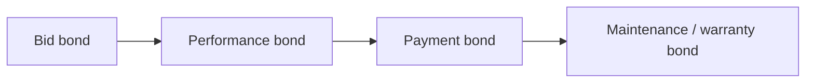

# Insurance, Surety Bonds & Certificate of Insurance (COI)

Tracks **GL**, **auto**, **WC**, **umbrella**, **professional** (if applicable), and **surety bond** programs for C-16 operations, plus **incoming COI** from subcontractors and vendors.

---

## Live visibility — policies & expirations (Power BI)

<iframe
  title="Power BI — Insurance & Bond Dashboard"
  src="https://app.powerbi.com/reportEmbed?reportId=REPLACE_INSURANCE_REPORT_ID&groupId=REPLACE_WORKSPACE_ID"
  width="100%"
  height="520"
  style="border:0;border-radius:8px;"
  loading="lazy"
  allowfullscreen>
</iframe>

---

## Our outbound coverage (template table)

| Policy | Typical limit | Expiration | Broker |
|--------|---------------|------------|--------|
| General liability | $1M / $2M | MM/DD/YYYY | — |
| Auto | $1M CSL | MM/DD/YYYY | — |
| Workers’ compensation | Statutory | MM/DD/YYYY | — |
| Umbrella | $5M | MM/DD/YYYY | — |
| Pollution (if carried) | — | MM/DD/YYYY | — |

---

## Surety bond types

| Bond | Purpose |
|------|---------|
| Bid | Guarantee bid validity |
| Performance | Complete contract |
| Payment | Pay subs & suppliers |
| Maintenance | Warranty period |

---

## Incoming COI minimums (example — edit per contract)

| Line | Minimum |
|------|---------|
| GL | $1M / $2M |
| WC | Statutory |
| Umbrella | $5M |
| Additional insured | GC & Owner as required |
| Waiver of subrogation | If required |

---

## COI defect list (reject / renew)

| Defect | Action |
|--------|--------|
| Wrong entity name | Request correction |
| Expired policy | Hold payment |
| Missing AI endorsement | Legal review |
| 30-day cancellation clause missing | Request update |

---

## Planner — renewals & COI chase

<iframe
  title="Planner — Insurance renewals"
  src="https://tasks.office.com/Home/PlanViews/REPLACE_PLANNER_PLAN_ID/Embed"
  width="100%"
  height="520"
  style="border:0;border-radius:8px;"
  loading="lazy"
  allowfullscreen>
</iframe>

---

*Cross-links: [Bidding](/departments/bidding/overview) · [Purchasing](/departments/purchasing/overview)*
