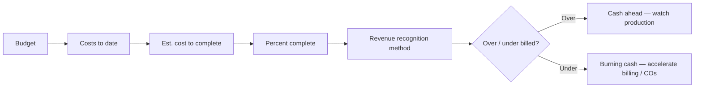

# Job Costing & Work in Process (WIP)

How **actual costs** accumulate against **budget** by **cost code** and **phase**, how **WIP** is reviewed monthly, and how **over/under billing** is interpreted for fire protection jobs.

---

## Live visibility — job cost & margin (Power BI)

<iframe
  title="Power BI — Job Cost Detail & WIP"
  src="https://app.powerbi.com/reportEmbed?reportId=REPLACE_JC_REPORT_ID&groupId=REPLACE_WORKSPACE_ID"
  width="100%"
  height="560"
  style="border:0;border-radius:8px;"
  loading="lazy"
  allowfullscreen>
</iframe>

---

## Standard cost code map (example)

| Code | Category | Typical drivers |
|------|----------|-----------------|
| 1000 | Material — pipe & fittings | LF, diameter, commodity index |
| 1100 | Material — hangers & seismic | Count, zone |
| 1200 | Material — heads & accessories | Head count, K-factor |
| 2000 | Subcontract — fire alarm tie-in | Allowance vs actual |
| 3000 | Equipment — rental / tools | Duration |
| 4000 | Labor — field | Crew hours × burdened rate |
| 5000 | Labor — shop fabrication | Shop hours × burdened rate |
| 6000 | Other — permits, inspections | Milestone |

---

## WIP review logic

---

## PM + Accounting monthly cadence

| Day | Action | Output |
|-----|--------|--------|
| 1–3 | PM updates **cost to complete** | ETC workbook |
| 3–5 | Accounting loads ERP snapshot | WIP schedule |
| 5–7 | Ops review exceptions | Top 10 risk jobs list |

---

## Forensic checks (red flags)

| Signal | Likely cause | Response |
|--------|--------------|----------|
| High material, low labor | Shop or field hours not posted | Timecard audit |
| Negative open AP on job | Mis-coding or vendor credits | GL scrub |
| Margin spike late in job | Missing costs still in AP pipeline | Accrual review |
| Huge “other” bucket | Dumping code | Reclassify |

---

## Planner — ETC & WIP action items

<iframe
  title="Planner — WIP exceptions"
  src="https://tasks.office.com/Home/PlanViews/REPLACE_PLANNER_PLAN_ID/Embed"
  width="100%"
  height="520"
  style="border:0;border-radius:8px;"
  loading="lazy"
  allowfullscreen>
</iframe>

---

*Cross-links: [Estimating](/departments/estimating/overview) · [Shop](/departments/shop/overview) · [Field](/departments/field/overview)*
