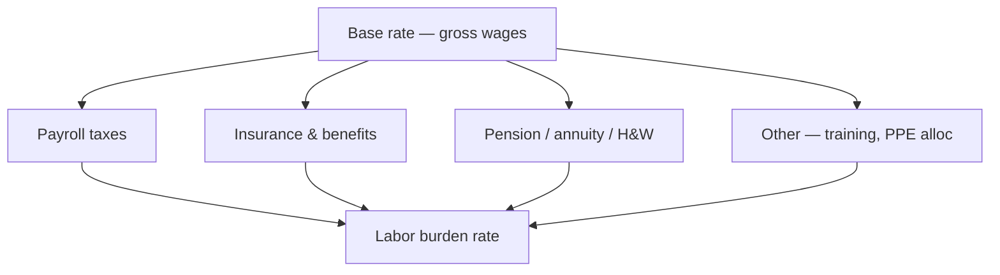

# Payroll, Union & Labor Burden

Covers **certified payroll** (public work), **union hall** reporting, **fringe** allocation, and **burdened labor rates** used in estimates and job cost for C-16 crews and shop fabricators.

---

## Live visibility — labor distribution (Power BI)

<iframe
  title="Power BI — Labor by Job & Craft"
  src="https://app.powerbi.com/reportEmbed?reportId=REPLACE_LABOR_REPORT_ID&groupId=REPLACE_WORKSPACE_ID"
  width="100%"
  height="520"
  style="border:0;border-radius:8px;"
  loading="lazy"
  allowfullscreen>
</iframe>

---

## Classifications (typical)

| Role | Prevailing / union craft | Notes |
|------|-------------------------|-------|
| Sprinkler fitter | UA / SPR fitter | Pipe install, hydro assist |
| Apprentice | Per agreement | Ratio supervision |
| Shop fabricator | Shop agreement / fitter | Thread, groove, cut |
| Foreman / GF | Supervisory | Non-manual portion rules per agreement |
| Alarm / low voltage (if in scope) | ELE / FAE | Only if licensed scope |

---

## Burden stack (conceptual)

---

## Certified payroll (DIR / federal)

| Requirement | Source | Retention |
|-------------|--------|-----------|
| Correct work classification | Contract / determination | Job file + wiki link |
| Straight + OT breakdown | Time system | 3 years minimum |
| Fringe paid to plans | Trust statements | Audit trail |
| Statement of compliance | Signed weekly | PDF in job folder |

---

## Time charging rules

| Rule | Detail |
|------|--------|
| Job number required | No “shop overhead” unless policy allows bucket |
| Cost code | Match job budget structure |
| Travel / per diem | Per union agreement & company policy |
| Shop indirect | Use **defined** codes only with controller approval |

---

## Planner — certified payroll deadlines

<iframe
  title="Planner — Payroll & DIR deadlines"
  src="https://tasks.office.com/Home/PlanViews/REPLACE_PLANNER_PLAN_ID/Embed"
  width="100%"
  height="520"
  style="border:0;border-radius:8px;"
  loading="lazy"
  allowfullscreen>
</iframe>

---

*Cross-links: [Job costing](/departments/accounting/job-costing-and-wip) · [Field](/departments/field/overview) · [Shop](/departments/shop/overview)*
