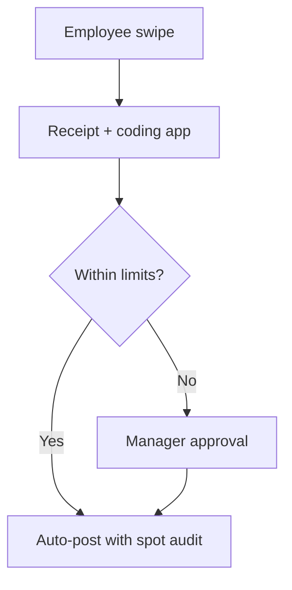

# PCard & Travel / Expense Policy

Use of **purchasing cards**, **mileage**, **per diem**, and **job-charged expenses** without breaking **job cost** or **audit** requirements.

---

## Live visibility — PCard & expense analytics (Power BI)

<iframe
  title="Power BI — PCard Spend by Job"
  src="https://app.powerbi.com/reportEmbed?reportId=REPLACE_PCARD_REPORT_ID&groupId=REPLACE_WORKSPACE_ID"
  width="100%"
  height="480"
  style="border:0;border-radius:8px;"
  loading="lazy"
  allowfullscreen>
</iframe>

---

## Allowed categories

| Category | PCard OK? | Job code required? |
|----------|-----------|---------------------|
| Small tools / consumables | Yes | If job-specific |
| Fuel for company vehicles | Yes | Vehicle ID |
| Emergency material < $— | Yes | Job + PM email ref |
| Entertainment | No | — |
| Cash withdrawal | No | — |

---

## Approval path

---

## Travel

| Item | Policy |
|------|--------|
| Airfare | Lowest logical fare / 7-day advance when possible |
| Lodging | GSA or contract city cap |
| Meals | Per diem or actuals — pick one per trip |
| Union travel | Follow CBA mileage / zone |

---

## Receipt standards

| Data element | Required |
|--------------|----------|
| Merchant name | Yes |
| Date | Yes |
| Itemization | If > $75 |
| Job / phase | If reimbursable to job |
| Business purpose | Yes |

---

## Planner — policy attestations & audits

<iframe
  title="Planner — PCard receipt audits"
  src="https://tasks.office.com/Home/PlanViews/REPLACE_PLANNER_PLAN_ID/Embed"
  width="100%"
  height="500"
  style="border:0;border-radius:8px;"
  loading="lazy"
  allowfullscreen>
</iframe>

---

*Cross-links: [AP & vendors](/departments/accounting/accounts-payable-and-vendor-management) · [Job costing](/departments/accounting/job-costing-and-wip)*
