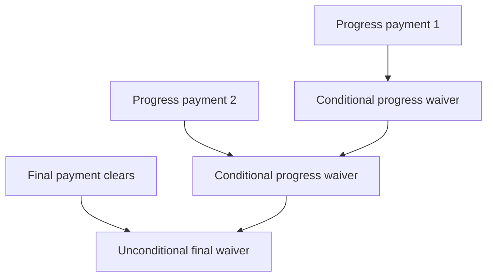

# Retainage, Preliminary Notices & Lien Releases

Mechanics lien **preliminary notice** timing, **retainage** tracking, and **conditional / unconditional** waiver discipline for fire protection subcontractors in California commercial construction.

---

## Live visibility — retainage & waivers (Power BI)

<iframe
  title="Power BI — Retainage & Lien Exposure"
  src="https://app.powerbi.com/reportEmbed?reportId=REPLACE_LIEN_REPORT_ID&groupId=REPLACE_WORKSPACE_ID"
  width="100%"
  height="520"
  style="border:0;border-radius:8px;"
  loading="lazy"
  allowfullscreen>
</iframe>

---

## Golden rules

| Rule | Practice |
|------|----------|
| Prelim early | Serve prelim within **20 days** of first furnishing where possible |
| Match waiver tier to payment | **Conditional** with progress pay; **Unconditional** only after cleared funds |
| Track upstream retainage | GC → Owner release triggers our **final** bill |
| Stop notice / bond claim | Escalation path in PM playbook |

---

## Waiver ladder (conceptual)

---

## Document retention

| Document | Minimum retention |
|----------|-------------------|
| Preliminary notices | Life of job + 2 years |
| Waivers | Life of job + 7 years |
| Stop notice copies | Until resolved + 2 years |
| Correspondence on disputes | Permanent summary in wiki / job |

---

## Roles

| Task | Responsible | Approver |
|------|-------------|----------|
| Issue prelim | PM / Legal template | PM |
| Collect GC waivers | Accounting | Controller |
| Final waiver package | Accounting | PM + Exec on >$— |

---

## Planner — prelim & waiver chase

<iframe
  title="Planner — Lien & waiver tracker"
  src="https://tasks.office.com/Home/PlanViews/REPLACE_PLANNER_PLAN_ID/Embed"
  width="100%"
  height="560"
  style="border:0;border-radius:8px;"
  loading="lazy"
  allowfullscreen>
</iframe>

---

*Cross-links: [AR & billing](/departments/accounting/accounts-receivable-and-progress-billing) · [Project management](/departments/project-management/overview)*
