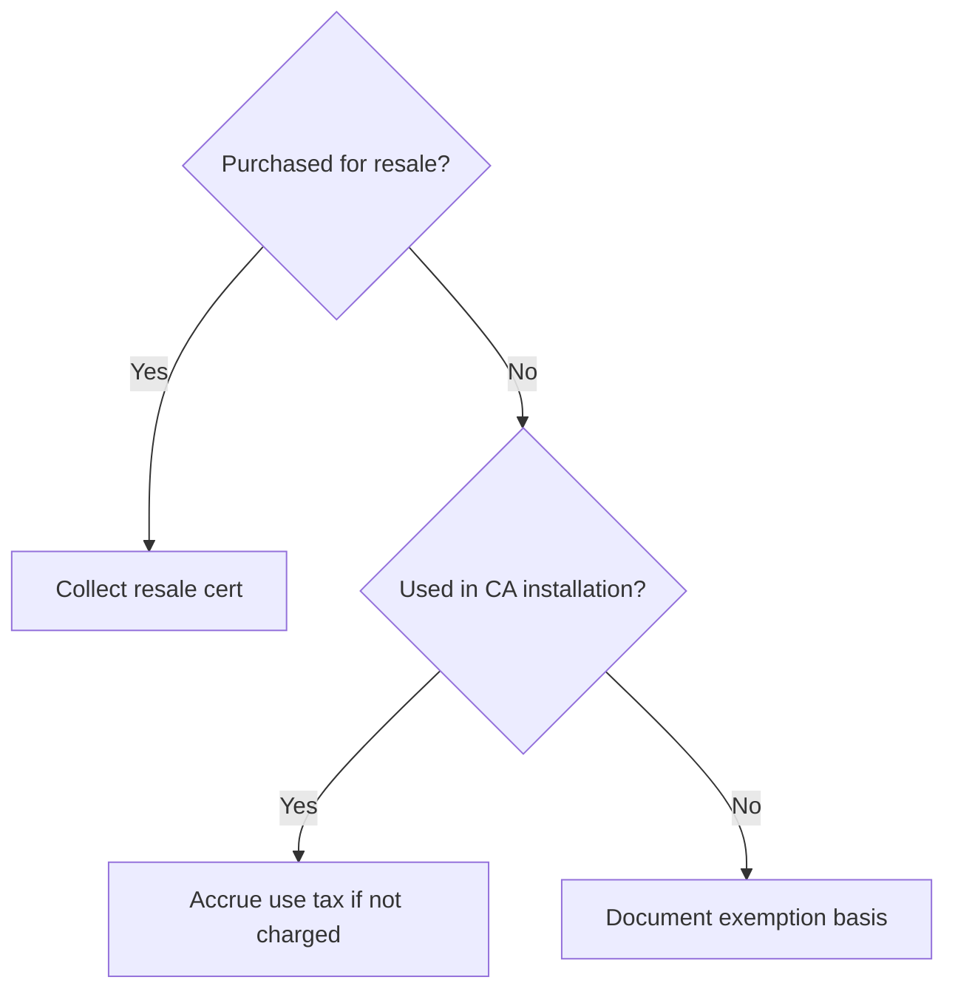

# Sales & Use Tax

California **sales and use tax** treatment for **materials**, **fabricated assemblies**, and **consumables** on fire sprinkler jobs, including **drop ship**, **inventory withdrawal**, and **use tax accrual** when vendors do not collect.

---

## Live visibility — tax by job (Power BI)

<iframe
  title="Power BI — Tax Accrual by Job"
  src="https://app.powerbi.com/reportEmbed?reportId=REPLACE_TAX_REPORT_ID&groupId=REPLACE_WORKSPACE_ID"
  width="100%"
  height="480"
  style="border:0;border-radius:8px;"
  loading="lazy"
  allowfullscreen>
</iframe>

---

## Decision matrix (simplified — confirm with tax advisor)

| Scenario | Common treatment | Documentation |
|----------|------------------|---------------|
| Material to **our** warehouse, resale to job | Resale cert to supplier | Resale cert on file |
| Material direct to job site (we are consumer) | Tax paid at purchase or use tax accrued | Invoice shows district |
| Fabricated in shop, installed by us | Often taxable on components; rules vary | Advisor memo per structure |
| Tooling / PPE / shop supplies | Taxable / overhead | GL account mapping |
| Out-of-state shipment | Nexus review | Legal / CPA sign-off |

---

## District sourcing checklist

| Field | Why it matters |
|-------|----------------|
| Ship-to address | District tax |
| Job address | Situs for certain contracts |
| Mixed contracts | Split rules |

---

## Month-end accrual entries

| Control | Owner |
|---------|-------|
| AP scrub for “no tax” lines | Staff accountant |
| Use tax spreadsheet by job | Controller |
| Nexus / rate update log | External CPA annually |

---

## Planner — tax review tasks

<iframe
  title="Planner — Sales & use tax reviews"
  src="https://tasks.office.com/Home/PlanViews/REPLACE_PLANNER_PLAN_ID/Embed"
  width="100%"
  height="500"
  style="border:0;border-radius:8px;"
  loading="lazy"
  allowfullscreen>
</iframe>

---

*Disclaimer: Not tax advice — confirm positions with qualified California tax counsel.*

*Cross-links: [AP & vendors](/departments/accounting/accounts-payable-and-vendor-management) · [Purchasing](/departments/purchasing/overview)*
