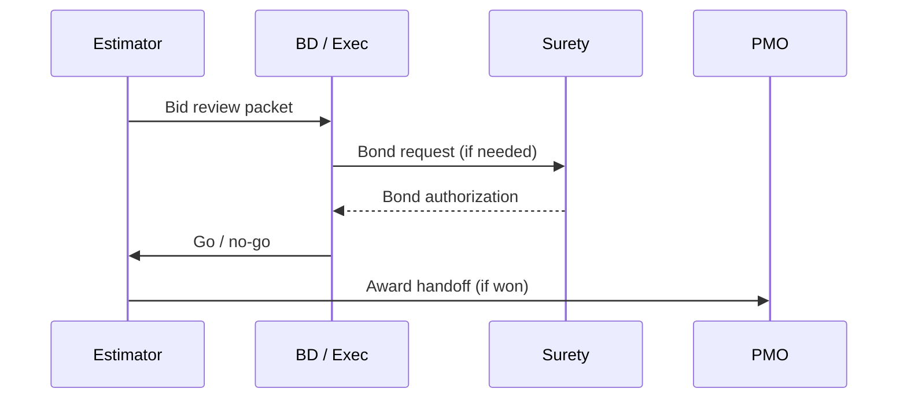

# Bidding — Strategy, Bonds & Handoff

Turns **estimates** into **submitted proposals** with correct **bonds**, **exclusions**, and **clean handoff** to **project management**.

---

## Live visibility — pipeline & hit rate (Power BI)

<iframe
  title="Power BI — Bid pipeline"
  src="https://app.powerbi.com/reportEmbed?reportId=REPLACE_BID_REPORT_ID&groupId=REPLACE_WORKSPACE_ID"
  width="100%"
  height="520"
  style="border:0;border-radius:8px;"
  loading="lazy"
  allowfullscreen>
</iframe>

---

## Bid control process

---

## Go / no-go criteria

| Factor | Weight |
|--------|--------|
| GC payment history | High |
| Capacity vs backlog | High |
| Risk profile | High |
| Margin | Medium |
| Strategic relationship | Medium |

---

## Standard exclusions (review each job)

| Topic | Example language |
|-------|------------------|
| Fire alarm | Monitor-only vs full FA |
| Concrete / coring | By others unless noted |
| Firestopping | By others unless noted |
| Demo | Quantities per drawing only |

---

## Planner — bid week war room

<iframe
  title="Planner — Bid week tasks"
  src="https://tasks.office.com/Home/PlanViews/REPLACE_PLANNER_PLAN_ID/Embed"
  width="100%"
  height="520"
  style="border:0;border-radius:8px;"
  loading="lazy"
  allowfullscreen>
</iframe>

---

*Cross-links: [Insurance & bonds](/departments/accounting/insurance-bonds-and-coi-tracking) · [Project management](/departments/project-management/overview)*
