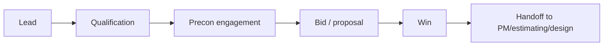

# Business Development & Client Strategy

Business development drives target market focus, preconstruction relationships, and pipeline quality for design-build and TI opportunities.

---

## Market segments

| Segment | Focus |
|---------|-------|
| Commercial office TI | Fast-track tenant improvements |
| Healthcare | Regulated retrofit and uptime-critical |
| Data centers / mission critical | Reliability and commissioning rigor |
| Industrial | Hazard-specific sprinkler design |

---

## Opportunity lifecycle

---

## Qualification gates

| Gate | Pass criteria |
|------|---------------|
| Customer quality | Payment history and relationship fit |
| Scope clarity | Drawings/specs and decision timeline |
| Capacity fit | Current backlog supports delivery |
| Margin potential | Meets strategic floor margin |

---

*Cross-links: [Estimating](/departments/estimating/overview) · [Bidding](/departments/bidding/overview)*