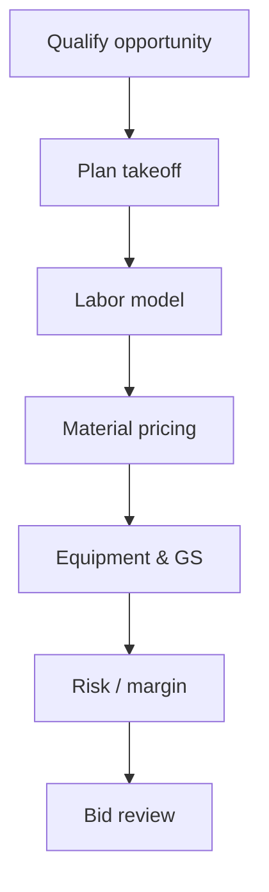

# Estimating — Takeoff, Pricing & Risk

**Estimating** builds **defendable bids** using **historical productivity**, **commodity exposure**, and **risk registers** for fire protection scope.

---

## Live visibility — win rate & margin (Power BI)

<iframe
  title="Power BI — Estimating KPIs"
  src="https://app.powerbi.com/reportEmbed?reportId=REPLACE_EST_REPORT_ID&groupId=REPLACE_WORKSPACE_ID"
  width="100%"
  height="560"
  style="border:0;border-radius:8px;"
  loading="lazy"
  allowfullscreen>
</iframe>

---

## Bid development flow

---

## Labor model inputs

| Input | Source |
|-------|--------|
| Crew mix | Norms database |
| Height factors | Drawing review |
| Seismic intensity | Job address |
| Overtime assumption | Schedule narrative |

---

## Risk register (template fields)

| Risk | Cost / schedule impact | Mitigation | Owner |
|------|------------------------|------------|-------|
| Long-lead valve | +$— / — wks | Early release PO | Purchasing |
| Conflicting specs | RFI exposure | Clarification addendum | Estimator |

---

## Planner — bid calendar

<iframe
  title="Planner — Bid deadlines & assignments"
  src="https://tasks.office.com/Home/PlanViews/REPLACE_PLANNER_PLAN_ID/Embed"
  width="100%"
  height="560"
  style="border:0;border-radius:8px;"
  loading="lazy"
  allowfullscreen>
</iframe>

---

*Cross-links: [Bidding](/departments/bidding/overview) · [Job costing](/departments/accounting/job-costing-and-wip)*
