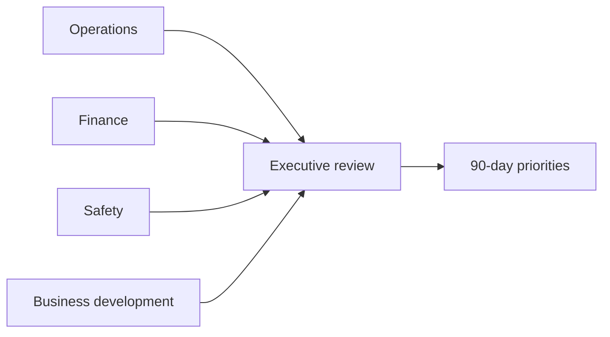

# Executive & Strategy Office

Executive leadership aligns growth, risk, cash, bonding capacity, safety, and operational excellence for California design-build and TI portfolio work.

---

## Quarterly operating system

| Cadence | Focus |
|---------|-------|
| Weekly | Top 10 risk jobs / cash / safety |
| Monthly | WIP, backlog quality, forecast |
| Quarterly | Strategic plan, market mix, staffing |

---

## Governance map

---

## Decision scorecard

| Area | KPI |
|------|-----|
| Financial | EBITDA, cash, DSO |
| Operational | On-time project delivery, rework |
| Safety | TRIR, near-miss closure rate |
| Growth | Win rate, pipeline quality |

---

*Cross-links: [Project dashboard](/projects/dashboard) · [Accounting close](/departments/accounting/month-end-close)*