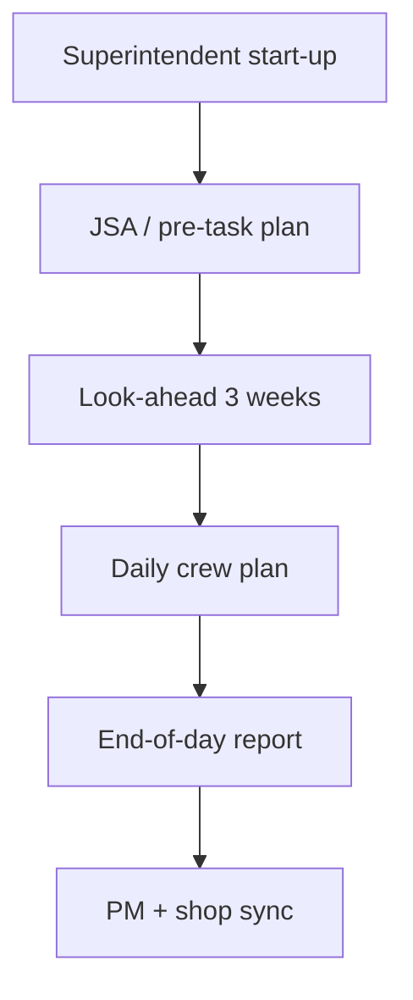

# Field Operations — Installation, Test & Turnover

Field crews deliver **on-site installation**, **hydrostatic / flow testing**, **AHJ inspections**, and **owner turnover** aligned with **NFPA 13 / 14 / 20 / 25** as applicable and **contract** requirements.

---

## Live visibility — field productivity & punch (Power BI)

<iframe
  title="Power BI — Field labor & punch list"
  src="https://app.powerbi.com/reportEmbed?reportId=REPLACE_FIELD_REPORT_ID&groupId=REPLACE_WORKSPACE_ID"
  width="100%"
  height="560"
  style="border:0;border-radius:8px;"
  loading="lazy"
  allowfullscreen>
</iframe>

---

## Daily rhythm

---

## Inspection readiness checklist (abbreviated)

| Item | Owner | Evidence |
|------|-------|----------|
| Heads correct temp & orientation | Foreman | Photos + cut sheets |
| Gauges in date | Foreman | Photo log |
| Access to test headers | Super | Walk with AHJ |
| Alarm monitoring notification | PM | Email confirmation |

---

## Hydrostatic test (wet systems) — field controls

| Control | Standard |
|---------|----------|
| Test pressure | Per NFPA / spec (not less than design) |
| Duration | Per NFPA |
| Gauge accuracy | Annual cal sticker |
| Blind list | Signed by GF |

---

## Planner — inspections & tests

<iframe
  title="Planner — Field inspections & hydro"
  src="https://tasks.office.com/Home/PlanViews/REPLACE_PLANNER_PLAN_ID/Embed"
  width="100%"
  height="560"
  style="border:0;border-radius:8px;"
  loading="lazy"
  allowfullscreen>
</iframe>

---

## Foreman tablet folder structure (example)

| Folder | Content |
|--------|---------|
| `01_Drawings` | Latest IFC PDFs |
| `02_Submittals` | Approved data sheets |
| `03_RFIs` | Signed RFIs |
| `04_Tests` | Hydro charts, flow tests |
| `05_Photos` | Geo-tagged daily sets |

---

*Cross-links: [Shop](/departments/shop/overview) · [Design](/departments/design/overview) · [Templates — daily report](/templates/template-field-daily-report)*
