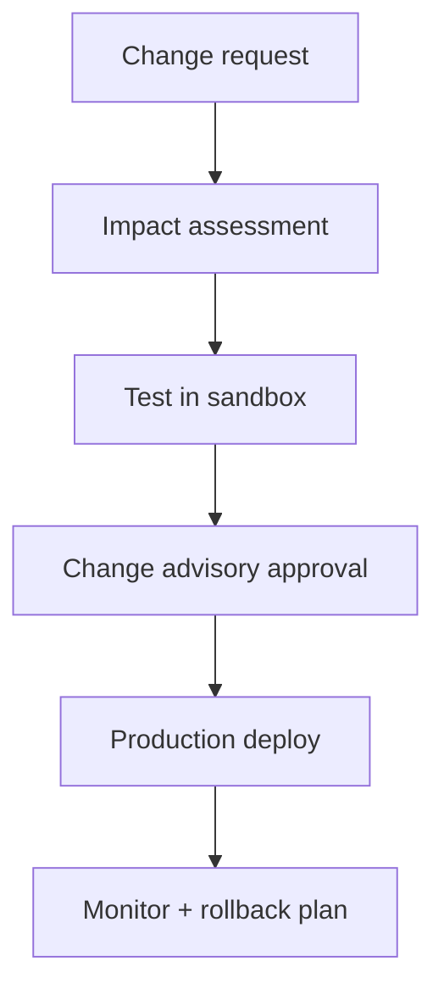

# Information Systems & Automation

Owns core business systems (ERP, BIM/VDC tools, PM platform, BI, document controls), security, backups, and integrations.

---

## System landscape

| Platform | Purpose | Owner |
|----------|---------|-------|
| ERP / accounting | Cost, billing, AP/AR | Accounting + IT |
| PM tool (Procore/ACC/etc.) | RFIs, submittals, docs | PMO + IT |
| BIM/VDC | Coordination models | Design |
| Planner / M365 | Task management | Department leads |
| Power BI | KPI reporting | Finance + IT |

---

## Change management

---

## Data governance controls

| Control | Standard |
|--------|----------|
| Access reviews | Quarterly |
| MFA | Mandatory for external access |
| Backup verification | Weekly restore test |
| Critical integrations | Alerting + owner |

---

*Cross-links: [Document retention](/departments/accounting/document-retention-and-audit-readiness) · [Templates](/templates/template-meeting-notes)*