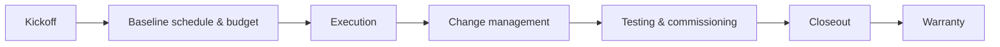

# Project Management — Schedule, Cost & Communication

**PM** owns **integrated baseline** — scope, schedule, cost, risk, and **stakeholder communication** from **kickoff** through **warranty**.

---

## Live visibility — portfolio health (Power BI)

<iframe
  title="Power BI — PMO portfolio dashboard"
  src="https://app.powerbi.com/reportEmbed?reportId=REPLACE_PMO_REPORT_ID&groupId=REPLACE_WORKSPACE_ID"
  width="100%"
  height="600"
  style="border:0;border-radius:8px;"
  loading="lazy"
  allowfullscreen>
</iframe>

---

## PM lifecycle

---

## Weekly PM cadence

| Meeting | Attendees | Output |
|---------|-----------|--------|
| Internal OPS | PM, Super, Shop, Design | 3-week lookahead |
| GC OAC | PM, Super | Minutes + RFIs |
| Cost review | PM, Controller | ETC update |

---

## Change order discipline

| Step | Artifact |
|------|----------|
| Triage | CO log ID |
| Pricing | Estimate backup |
| Approval | Signed CO |
| ERP | Budget transfer |

---

## Planner — COs & owner submittals

<iframe
  title="Planner — PM action tracker"
  src="https://tasks.office.com/Home/PlanViews/REPLACE_PLANNER_PLAN_ID/Embed"
  width="100%"
  height="560"
  style="border:0;border-radius:8px;"
  loading="lazy"
  allowfullscreen>
</iframe>

---

*Cross-links: [Projects hub](/projects/dashboard) · [Sample job](/projects/TI-2026-045/downtown-office-renovation)*
