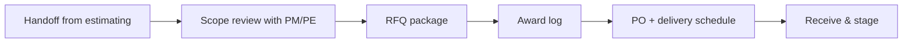

# Purchasing & Supply Chain

**Buyout**, **PO issuance**, **expediting**, **receiving**, and **vendor scorecards** for fire protection materials — from **listed** heads and pipe to **long-lead** equipment (FP cabinets, valves, pumps).

---

## Live visibility — open POs & lead times (Power BI)

<iframe
  title="Power BI — Purchasing pipeline"
  src="https://app.powerbi.com/reportEmbed?reportId=REPLACE_PO_REPORT_ID&groupId=REPLACE_WORKSPACE_ID"
  width="100%"
  height="560"
  style="border:0;border-radius:8px;"
  loading="lazy"
  allowfullscreen>
</iframe>

---

## Buyout sequence

---

## RFQ package contents

| Item | Detail |
|------|--------|
| Drawing list | Rev + date |
| Spec sections | 21 13 00 (example) |
| Alternates | Head brand, pipe wall schedule |
| Delivery windows | Floor / zone release |
| Submittal requirements | Match design tracker |

---

## Receiving & discrepancy

| Status | Action |
|--------|--------|
| Full match | Post receipt; notify shop |
| Short | Carrier claim + buyer note |
| Damage | Photo log + RMA |
| Wrong material | Quarantine tag; no install |

---

## Vendor KPIs (quarterly)

| Vendor | OTIF % | Quality incidents | Quote turnaround |
|--------|--------|-------------------|------------------|
| Supplier A | — | — | — |
| Supplier B | — | — | — |

---

## Planner — expedite & backorder board

<iframe
  title="Planner — Purchasing expedites"
  src="https://tasks.office.com/Home/PlanViews/REPLACE_PLANNER_PLAN_ID/Embed"
  width="100%"
  height="560"
  style="border:0;border-radius:8px;"
  loading="lazy"
  allowfullscreen>
</iframe>

---

*Cross-links: [Shop](/departments/shop/overview) · [Design](/departments/design/overview) · [Accounting AP](/departments/accounting/accounts-payable-and-vendor-management)*
