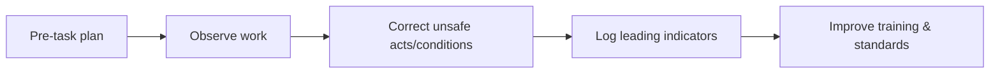

# Safety Department — Injury Prevention & Compliance

Safety governs OSHA compliance, pre-task planning, incident learning, and subcontractor safety alignment across shop, field, and service.

---

## Regulatory baseline

| Topic | Reference |
|------|-----------|
| OSHA construction safety | 29 CFR 1926 |
| Cal/OSHA | Title 8, CCR |
| Injury and illness prevention | IIPP |
| Heat illness prevention | California mandatory program |

---

## Daily safety control loop

---

## Mandatory field practices

| Practice | Standard |
|---------|----------|
| Daily JSA / pre-task | Required before work starts |
| Fall protection | 100% tie-off where required |
| Lift operation | Certified operator only |
| Hot work | Permit + fire watch |
| Incident reporting | Same shift notification |

---

## Planner — safety actions

<iframe title="Planner — Safety corrective actions" src="https://tasks.office.com/Home/PlanViews/REPLACE_SAFETY_PLAN_ID/Embed" width="100%" height="520" style="border:0;border-radius:8px;" loading="lazy" allowfullscreen></iframe>

---

*Cross-links: [Pre-job safety template](/templates/template-pre-job-safety-briefing) · [Field](/departments/field/overview)*