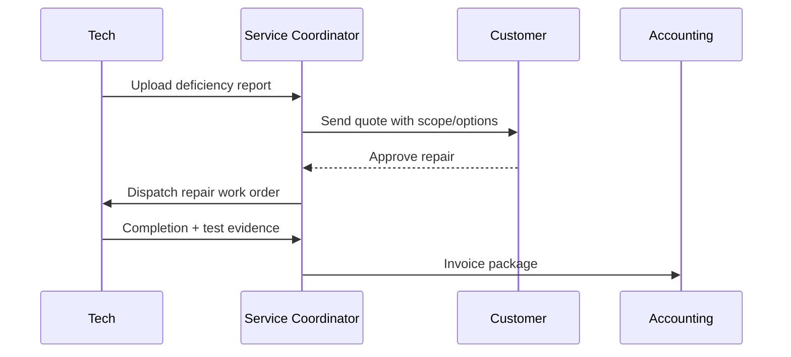

# Deficiency & Service Workflow

Standard process for converting inspection findings into approved repairs and closeout documentation.

---

## Status model

| Status | Meaning | SLA |
|--------|---------|-----|
| New | Finding recorded | Same day |
| Quote pending | Pricing in progress | 3 business days |
| Awaiting approval | Customer decision | Follow-up every 5 days |
| Scheduled | Work date assigned | Per urgency |
| Closed | Repair complete and documented | 24 hours for report upload |

---

## Workflow

---

## Required evidence package

| Evidence | Required |
|----------|----------|
| Before/after photos | Yes |
| Device ID / location | Yes |
| Test result / pass-fail | Yes |
| Customer signoff | Yes |
| Material and labor detail | Yes |

---

*Cross-links: [Service overview](/departments/service/overview) · [ITC](/standards/inspection-testing-commissioning)*