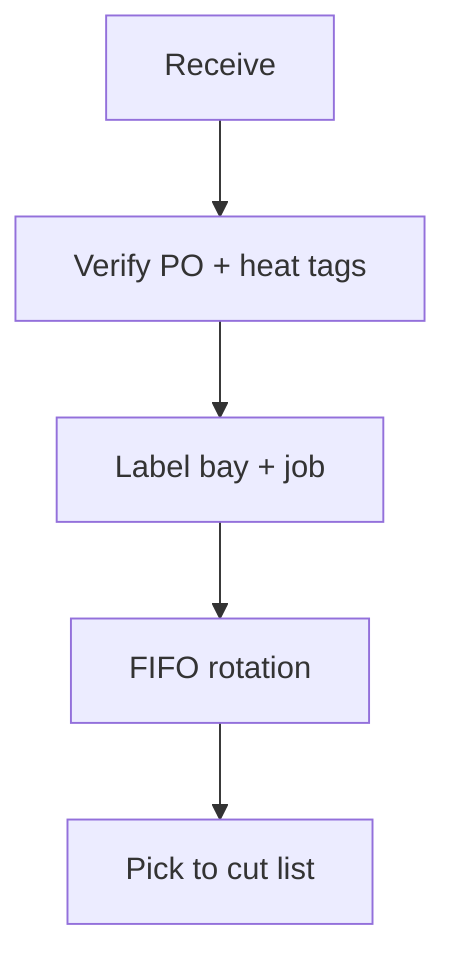
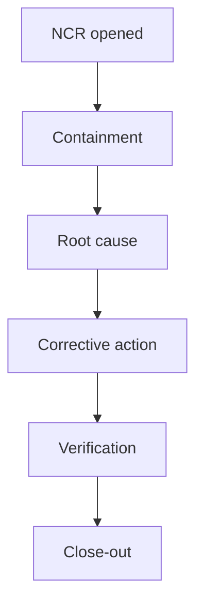

# Shop Fabrication Procedures (Master SOP)

**Document ID:** SHOP-SOP-001  
**Scope:** Carbon steel / galvanized wet systems — thread, groove, cut-to-length, minor fitting make-up, tagging, bundle, and release to field.  
**Authority:** Shop Manager · PE sign-off on deviations

---

## Live reference — fab schedule (Planner)

<iframe
  title="Planner — Daily fab board"
  src="https://tasks.office.com/Home/PlanViews/REPLACE_SHOP_PLAN_ID/Embed"
  width="100%"
  height="520"
  style="border:0;border-radius:8px;"
  loading="lazy"
  allowfullscreen>
</iframe>

---

## 1. Preconditions (no exceptions)

| Gate | Verification |
|------|--------------|
| Released for fabrication | ERP flag + PE email or workflow |
| Latest IFC / shop drawings | Rev block matches submittal log |
| Material matched to heat/lot policy | MTR on file when spec requires |
| Threader / groover within calibration | Daily checklist complete |

---

## 2. Personal protective equipment (minimum)

| Task | PPE |
|------|-----|
| Cutting / grinding | Safety glasses, face shield, gloves, hearing |
| Threading | Safety glasses, gloves, no loose clothing |
| Overhead hoist | Hard hat, rigging-trained operator |

---

## 3. Material handling & storage

| Rule | Standard |
|------|----------|
| Segregation | Do not co-mingle jobs on same rack without dividers |
| Damage | Quarantine — red tag + photo |
| Shortages | Buyer notified before substituting |

---

## 4. Cutting to length

| Step | Requirement |
|------|-------------|
| 4.1 | Compare cut list to **zone / elevation / system** |
| 4.2 | Allow for thread engagement per **manufacturer** tables |
| 4.3 | Deburr all cuts; blow out chips |
| 4.4 | Mark piece with **indelible** job + line + sequence |

---

## 5. Threading (carbon / galvanized)

| Parameter | Control |
|-----------|---------|
| Machine setup | Match pipe size / schedule chart |
| Thread compound | Approved list only |
| Inspection | Go / no-go gauge each **10 joints** or **shift start** |
| Rejects | Cut back, re-thread once; if fail, scrap log |

---

## 6. Roll grooving

| Parameter | Control |
|-----------|---------|
| Roll set verification | Chart posted at machine |
| Lubrication | Per OEM |
| Groove dimension | Periodic sample measure + log |
| Victaulic / coupling compatibility | Only paired approved components |

---

## 7. Assembly & fit-up

| Step | Standard |
|------|----------|
| 7.1 | Finger-tight + **torque** where spec requires |
| 7.2 | Support fabricated spools on **non-abrasive** horses |
| 7.3 | No standing water in idle spools (winterization note) |
| 7.4 | **Hanger locations** painted or tagged per drawing |

---

## 8. Welding / brazing (if in scope)

> If shop does **no** pressure welding, mark N/A and reference **approved subcontract** welder WPS/PQR library.

| Control | Record |
|---------|--------|
| WPS # | Traveler |
| Welder stamp | Log |
| NDE hold points | QC form |

---

## 9. Quality hold points (QHP)

| QHP | Inspection |
|-----|------------|
| QHP-1 | First piece of run — thread / groove |
| QHP-2 | Random 10% spool length / square |
| QHP-3 | Bundle completeness vs pick list |

---

## 10. Tagging, labeling & color code

| Tag type | Content |
|----------|---------|
| Barcode / QR | Job, drawing, piece mark |
| Color band | System (wet, standpipe, etc.) — legend posted |

**Example legend (edit to company standard):**

| Color | System |
|-------|--------|
| Red | Wet — East wing |
| Blue | Wet — West wing |
| Yellow | Standpipe |

---

## 11. Bundling, protection & loading

| Rule | Why |
|------|-----|
| End caps / foam separation | Protect threads & grooves |
| Weight limit per bundle | Rigging safety |
| Load photos | Dispute prevention |
| BOL signed by driver | Chain of custody |

---

## 12. Documentation package per release

| Item | Owner |
|------|-------|
| Fab traveler PDF | Shop admin |
| Updated spool map (if BIM) | VDC |
| Hydrotest batch grouping note | Field / QC |

---

## 13. Non-conformance (NCR)

| Severity | Example | Timeline |
|----------|---------|----------|
| Minor | Label error | Fix same day |
| Major | Wrong schedule pipe installed in bundle | Stop shipment, notify PM |

---

## 14. Key performance indicators (shop board)

| KPI | Week | MTD |
|-----|------|-----|
| Fab hours vs earned hours | — | — |
| Rework hours | — | — |
| OTIF to field | — | — |
| Safety observations | — | — |

---

## Live analytics — rework Pareto (Power BI)

<iframe
  title="Power BI — Shop rework Pareto"
  src="https://app.powerbi.com/reportEmbed?reportId=REPLACE_SHOP_QC_REPORT_ID&groupId=REPLACE_WORKSPACE_ID"
  width="100%"
  height="480"
  style="border:0;border-radius:8px;"
  loading="lazy"
  allowfullscreen>
</iframe>

---

## Revision log

| Rev | Date | Author | Summary |
|-----|------|--------|---------|
| A | 2026-03-20 | Shop Manager | Initial wiki publish |

---

*Cross-links: [Shop overview](/departments/shop/overview) · [Field installation](/departments/field/overview) · [Standards](/standards/overview)*
