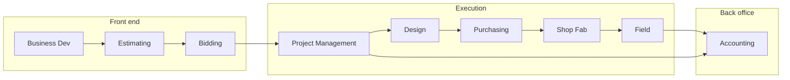

# C-16 Fire Protection Operations Wiki

Welcome to the **Western States Mechanical — Fire Protection** knowledge base. This wiki connects accounting, estimating, design, fabrication, field installation, and project management into one governed system aligned with **NFPA** standards, **California C-16** licensing scope, and our **Lean** operating model.

---

## Live operations dashboards

> Replace the `src` URLs below with your tenant-specific **Microsoft Planner** embed and **Power BI** *Publish to web* or *Secure embed* links. In Wiki.js, ensure raw HTML is allowed for your editor role.

### Microsoft Planner — company-wide task board

<div class="wiki-embed wiki-embed--planner">

<iframe
  title="Microsoft Planner — Fire Protection Operations"
  src="https://tasks.office.com/Home/PlanViews/REPLACE_WITH_YOUR_PLAN_ID/Embed"
  width="100%"
  height="640"
  style="border:0;border-radius:8px;min-height:480px;"
  loading="lazy"
  allowfullscreen>
</iframe>

</div>

### Power BI — KPI & WIP snapshot

<div class="wiki-embed wiki-embed--powerbi">

<iframe
  title="Power BI — Job Cost & WIP Dashboard"
  src="https://app.powerbi.com/reportEmbed?reportId=REPLACE_REPORT_ID&groupId=REPLACE_WORKSPACE_ID"
  width="100%"
  height="600"
  style="border:0;border-radius:8px;"
  loading="lazy"
  allowfullscreen>
</iframe>

</div>

---

## At-a-glance KPIs (sample — sync from ERP / BI)

| Metric | This month | Target | Owner |
|--------|------------|--------|-------|
| Revenue recognized | $— | — | Accounting |
| Gross margin % | —% | ≥ —% | PM / Estimating |
| AR > 60 days | $— | $0 critical | Accounting |
| Open COs (unsigned) | — | 0 > 30 days | PM |
| Shop on-time fab releases | —% | ≥ 95% | Shop |
| Field TFVC (first-time verification clean) | —% | ≥ 90% | Field |
| NFPA 13 design cycle time | — days | ≤ — days | Design |

---

## How work flows through the company



---

## Quick navigation

| Area | Purpose |
|------|---------|
| [Accounting](/departments/accounting/accounts-payable-and-vendor-management) | AP, AR, job cost, tax, retainage, close |
| [Purchasing](/departments/purchasing/overview) | Buyout, POs, receiving, vendor performance |
| [Shop](/departments/shop/overview) | Fabrication, QA, material staging |
| [Field](/departments/field/overview) | Installation, inspections, turnover |
| [Design](/departments/design/overview) | Hydraulics, BIM, submittals |
| [Estimating](/departments/estimating/overview) | Takeoff, pricing, risk registers |
| [Bidding](/departments/bidding/overview) | Bid calendar, bonds, handoff to PM |
| [Project management](/departments/project-management/overview) | Schedule, COs, owner communication |
| [Projects hub](/projects/dashboard) | Active jobs, health, links |
| [Standards](/standards/overview) | NFPA / CBC / company criteria |
| [Lean tools](/lean-tools/overview) | 5S, kanban, A3, standard work |
| [Templates](/templates/template-meeting-notes) | Ready-to-copy Wiki blocks |

---

## Project spotlight

**Active template job:** [TI-2026-045 — Downtown Office Renovation](/projects/TI-2026-045/downtown-office-renovation)

Use that page as the **gold-standard** layout for every new `[project-id]` folder in Git Storage.

---

## Roles & RACI (summary)

```mermaid
flowchart TB
  PM[Project Manager]
  PE[Project Engineer / Design]
  FS[Field Superintendent]
  AC[Accounting]
  PM -->|Accountable| PE
  PM -->|Accountable| FS
  PM -->|Informed| AC
  PE -->|Responsible| Submittals
  FS -->|Responsible| Inspections
  AC -->|Responsible| Billing alignment
```

---

*Last reviewed: March 2026 · Owner: Executive team · Questions: PMO*
