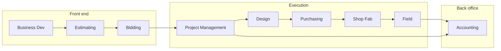

# C-16 Fire Protection Operations Wiki

Welcome to the **Western States Mechanical — Fire Protection** knowledge base. This wiki connects accounting, estimating, design, fabrication, field installation, and project management into one governed system aligned with **NFPA** standards, **California C-16** licensing scope, and our **Lean** operating model.

---

## Live operations dashboards

> Replace the `src` URLs below with your tenant-specific **Microsoft Planner** embed and **Power BI** *Publish to web* or *Secure embed* links. In Wiki.js, ensure raw HTML is allowed for your editor role.

### Microsoft Planner — company-wide task board

<div class="wiki-embed wiki-embed--planner">

<iframe
  title="Microsoft Planner — Fire Protection Operations"
  src="https://tasks.office.com/Home/PlanViews/REPLACE_WITH_YOUR_PLAN_ID/Embed"
  width="100%"
  height="640"
  style="border:0;border-radius:8px;min-height:480px;"
  loading="lazy"
  allowfullscreen>
</iframe>

</div>

### Power BI — KPI & WIP snapshot

<div class="wiki-embed wiki-embed--powerbi">

<iframe
  title="Power BI — Job Cost & WIP Dashboard"
  src="https://app.powerbi.com/reportEmbed?reportId=REPLACE_REPORT_ID&groupId=REPLACE_WORKSPACE_ID"
  width="100%"
  height="600"
  style="border:0;border-radius:8px;"
  loading="lazy"
  allowfullscreen>
</iframe>

</div>

---

## At-a-glance KPIs (sample — sync from ERP / BI)

| Metric | This month | Target | Owner |
|--------|------------|--------|-------|
| Revenue recognized | $— | — | Accounting |
| Gross margin % | —% | ≥ —% | PM / Estimating |
| AR > 60 days | $— | $0 critical | Accounting |
| Open COs (unsigned) | — | 0 > 30 days | PM |
| Shop on-time fab releases | —% | ≥ 95% | Shop |
| Field TFVC (first-time verification clean) | —% | ≥ 90% | Field |
| NFPA 13 design cycle time | — days | ≤ — days | Design |

---

## How work flows through the company



---

## Start here

### By role

| Role | Best first page |
|------|-----------------|
| Owner / leadership | [Executive office](/departments/executive/overview) |
| Project manager | [Project management](/departments/project-management/overview) |
| Superintendent / field lead | [Field operations](/departments/field/overview) |
| Designer / PE | [Design](/departments/design/overview) |
| Estimator / bidder | [Estimating](/departments/estimating/overview) |
| Accounting / purchasing | [Accounting AP](/departments/accounting/accounts-payable-and-vendor-management) + [Purchasing](/departments/purchasing/overview) |
| New hire | [Onboarding home](/company/onboarding/overview) |

### By task

| Task | Best first page |
|------|-----------------|
| Build company context | [Company hub](/company/overview) |
| Win work and hand off cleanly | [Business development](/departments/business-development/overview) + [Bidding](/departments/bidding/overview) |
| Execute a project start-to-finish | [Project lifecycle](/processes/project-lifecycle-design-build) |
| Run fast TI projects | [TI fast-track workflow](/processes/tenant-improvement-fast-track) |
| Control code and quality risk | [Standards](/standards/overview) |
| Use copy/paste job tools | [Templates](/templates/template-meeting-notes) |
| See portfolio health | [Projects hub](/projects/dashboard) |

### Browse by library

| Library | Purpose |
|---------|---------|
| [Company](/company/start-here) | About, mission, people, onboarding, office operations |
| [Departments](/departments/project-management/overview) | Functional playbooks by team |
| [Processes](/processes/overview) | Cross-functional operating workflows |
| [Standards](/standards/overview) | Technical/code and QA governance |
| [Templates](/templates/template-meeting-notes) | Ready-to-use working formats |
| [Lean tools](/lean-tools/overview) | Continuous improvement methods |

---

## Project spotlight

**New job starter:** duplicate [Project home template](/projects/template-project/project-home) (folder `projects/template-project/` → `projects/<ProjectID>/`).

**Filled sample:** [TI-2026-045 — Downtown Office Renovation](/projects/TI-2026-045/downtown-office-renovation).

---

## Roles & RACI (summary)

```mermaid
flowchart TB
  PM[Project Manager]
  PE[Project Engineer / Design]
  FS[Field Superintendent]
  AC[Accounting]
  PM -->|Accountable| PE
  PM -->|Accountable| FS
  PM -->|Informed| AC
  PE -->|Responsible| Submittals
  FS -->|Responsible| Inspections
  AC -->|Responsible| Billing alignment
```

---

*Last reviewed: March 2026 · Owner: Executive team · Questions: PMO*
