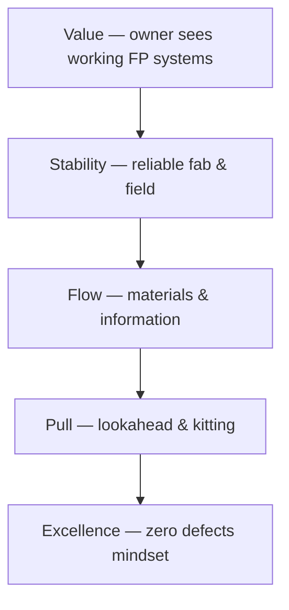

# Lean Tools — Continuous Improvement

How we apply **Lean** in a fire protection contractor: **standard work**, **visual management**, **A3 problem solving**, and **respect for people**.

---

## Lean pillars (our interpretation)

---

## Tool menu

| Tool | Use when | Wiki page |
|------|----------|-----------|
| **5S** | Shop & yard disorganization | [5S & visual workplace](/lean-tools/5s-and-visual-workplace) |
| **Kanban** | Stockouts / expediting chaos | See below |
| **A3** | Recurring breakdown (>3 occurrences) | Template in PM practice |
| **Gemba walks** | Disconnect between office & field | Ops calendar |

---

## Live Lean KPI board (Power BI)

<iframe
  title="Power BI — Lean KPIs"
  src="https://app.powerbi.com/reportEmbed?reportId=REPLACE_LEAN_REPORT_ID&groupId=REPLACE_WORKSPACE_ID"
  width="100%"
  height="520"
  style="border:0;border-radius:8px;"
  loading="lazy"
  allowfullscreen>
</iframe>

---

## Material kanban signals (example)

| Bin | Min | Max | Replenishment owner |
|-----|-----|-----|---------------------|
| 2″ grooved couplings | 40 | 120 | Purchasing |
| 1″ black 21′ sticks | 60 | 200 | Purchasing |
| CPVC fittings kit | 1 | 3 totes | Shop lead |

---

## Planner — kaizen events

<iframe
  title="Planner — Kaizen backlog"
  src="https://tasks.office.com/Home/PlanViews/REPLACE_PLANNER_PLAN_ID/Embed"
  width="100%"
  height="520"
  style="border:0;border-radius:8px;"
  loading="lazy"
  allowfullscreen>
</iframe>

---

*Cross-links: [Shop](/departments/shop/overview) · [Templates — lessons learned](/templates/template-lessons-learned)*
