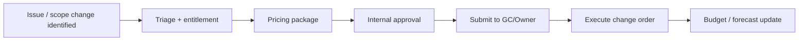

# Change Order Workflow (Enterprise Standard)

Single workflow for identifying, pricing, approving, and booking change orders across all projects.

---

## CO workflow

---

## Required package

| Component | Required |
|----------|----------|
| Narrative with scope boundary | Yes |
| Labor/material backup | Yes |
| Schedule impact statement | Yes |
| Exclusions/assumptions | Yes |

---

## Governance thresholds

| Value | Approval |
|------|----------|
| <= $25k | PM + estimator |
| $25k-$100k | PM + ops manager |
| > $100k | Executive signoff |

---

*Cross-links: [CO template](/templates/template-change-order-summary) · [PM](/departments/project-management/overview)*