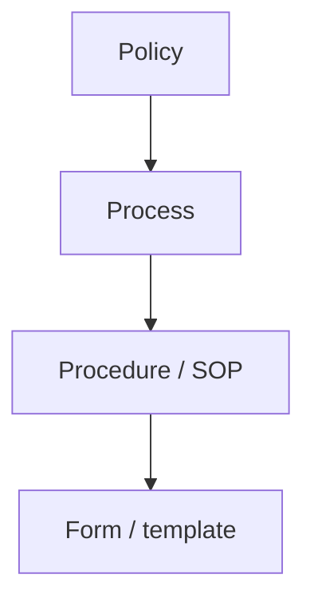

# Core Processes Index

Company-wide process library for design-build and TI execution in California.

---

## Process catalog

| Process | Link |
|---------|------|
| End-to-end project lifecycle | [Project lifecycle](/processes/project-lifecycle-design-build) |
| Fast-track tenant improvements | [TI fast-track workflow](/processes/tenant-improvement-fast-track) |
| Change order control | [Change order workflow](/processes/change-order-workflow) |
| RFI / submittal control | [Submittal & RFI workflow](/processes/submittal-rfi-workflow) |

---

## Process hierarchy

---

*Cross-links: [Standards](/standards/overview) · [Templates](/templates/template-meeting-notes)*