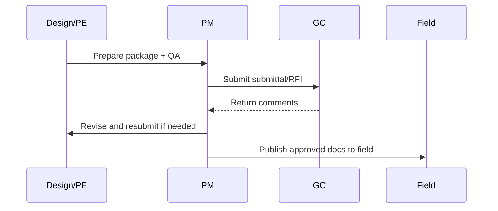

# Submittal & RFI Workflow

Standard workflow to reduce rework by controlling response times, versioning, and field dissemination.

---

## Workflow

---

## SLA targets

| Type | Internal target |
|------|-----------------|
| New RFI draft | 2 business days |
| Submittal package prep | 5 business days |
| Returned comments to field | Same day |

---

## Version control rules

| Rule | Standard |
|------|----------|
| Single source | PM system is source of truth |
| Revision naming | `SUB-###-Rev#` / `RFI-###` |
| Field issue | Use only approved/current docs |

---

*Cross-links: [Design](/departments/design/overview) · [RFI template](/templates/template-rfi-submittal-entry)*