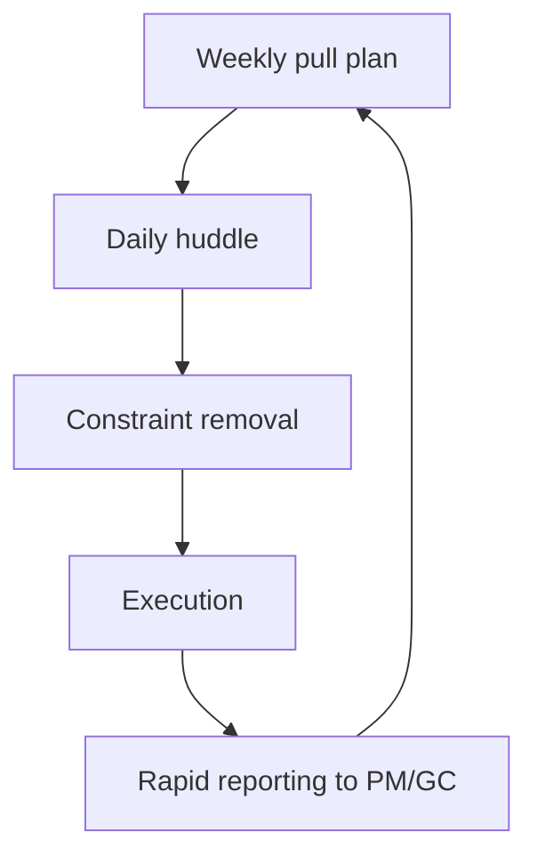

# Tenant Improvement Fast-Track Workflow

TI projects require compressed design and field cadence with strict version control and customer communication.

---

## TI operating model

| Characteristic | Control |
|---------------|---------|
| Compressed duration | Weekly look-ahead and daily constraints log |
| Frequent revisions | RFI/submittal timestamp discipline |
| Occupied buildings | Off-hours planning and safety controls |
| Coordination density | BIM / ceiling coordination checkpoints |

---

## Fast-track control loop

---

## TI checklist

| Item | Owner |
|------|-------|
| Off-hour access plan | PM + Super |
| Dust / disruption controls | Super |
| Temporary coverage plan | Design + Field |
| Inspection booking windows | PM |

---

*Cross-links: [Field](/departments/field/overview) · [Design](/departments/design/overview) · [Sample TI project](/projects/TI-2026-045/downtown-office-renovation)*