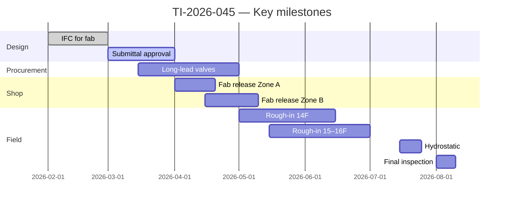
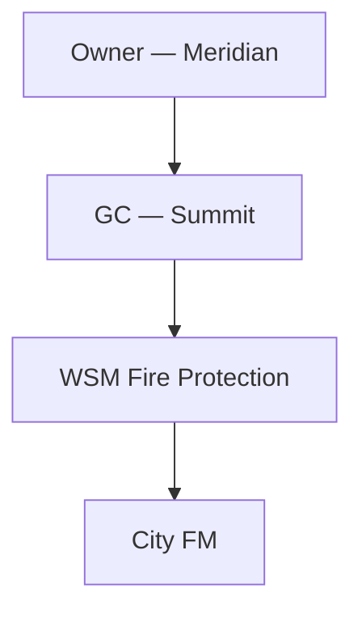

# TI-2026-045 — Downtown Office Renovation

**Owner:** Meridian Properties  
**GC:** Summit Builders Inc.  
**Contract:** $1,847,500 (revised budget $1,902,400 with CO-003 pending)  
**PM:** Ana Rivera · **Super:** Chris Okonkwo · **PE:** Priya Shah  
**Jurisdiction:** City fire marshal + **NFPA 13** (2022) / **CBC** as adopted

---

## Project control room — Power BI (job-specific)

<iframe
  title="Power BI — TI-2026-045 cost & schedule"
  src="https://app.powerbi.com/reportEmbed?reportId=REPLACE_JOB_REPORT_ID&groupId=REPLACE_WORKSPACE_ID&filter=Jobs/JobId eq 'TI-2026-045'"
  width="100%"
  height="600"
  style="border:0;border-radius:8px;"
  loading="lazy"
  allowfullscreen>
</iframe>

---

## One-page snapshot

| Attribute | Value |
|-----------|-------|
| Address | 1200 Market Street — Floors 14–16 |
| System | Wet pipe — quick-response heads in office areas |
| Design density | As calc book Rev D |
| Permit # | FP-2025-8841 |
| AHJ inspector | T. Nguyen |
| Substantial completion | 08/15/2026 (contract) |
| Liquidated damages | $2,500 / day |

---

## Scope highlights

- Demolition of existing branch lines **Floors 15–16** per demo drawings **M-501 Rev C**.
- New **feed main** from existing zone control riser **ZR-3**; **hydraulic recalc** Rev D submitted 02/28/2026.
- **Seismic bracing** per NFPA 13 Chapter 18 — **high seismic** category per geotech.
- **Standpipe** not in our contract section — **verify** GC matrix.

---

## Master schedule (milestone view)

---

## Cost & billing status

| Metric | Original | Current budget | Actual + commitments | Forecast margin |
|--------|----------|----------------|----------------------|-----------------|
| Material | $612,000 | $638,000 | $604,200 | On track |
| Labor field | $418,000 | $452,000 | $371,500 | Watch OT on 15F |
| Shop fab | $124,000 | $124,000 | $88,300 | On track |
| Subcontracts | $195,000 | $195,000 | $142,000 | Alarm FA-B2 pending |
| GS & fee | $498,500 | $493,400 | — | CO-003 covers delta |

---

## Open items / risk register

| ID | Risk | Impact | Mitigation | Owner |
|----|------|--------|------------|-------|
| R-06 | Ceiling height conflict **15F corridor** | Rework | RFI-118 + BIM clash meeting | PE |
| R-09 | GC late core drill access | 1-week slip | Lookahead + notice letter | PM |
| R-12 | Valve vendor backorder | Hydro delay | Alternate equal per spec 8.2 | Purchasing |

---

## Submittals & RFIs (summary)

| Type | Submitted | Approved | Open |
|------|-----------|----------|------|
| Head data | 01/10/2026 | 02/05/2026 | 0 |
| Valve / riser | 01/12/2026 | 02/12/2026 | Resubmit on gauge trim |
| RFI log | — | — | 3 open (see Procore #) |

---

## Job Planner board (tasks)

<iframe
  title="Microsoft Planner — TI-2026-045"
  src="https://tasks.office.com/Home/PlanViews/REPLACE_TI_2026_045_PLAN_ID/Embed"
  width="100%"
  height="640"
  style="border:0;border-radius:8px;"
  loading="lazy"
  allowfullscreen>
</iframe>

---

## Testing & commissioning (planned)

| Test | System / portion | Target date | Witness |
|------|------------------|-------------|---------|
| Hydrostatic | Floors 14–16 | 07/22/2026 | AHJ + GC |
| Main drain | Riser ZR-3 | 07/23/2026 | Super |
| Flow test | Remote area #2 | 07/25/2026 | AHJ |

---

## Closeout package index

| Document | Status |
|----------|--------|
| As-builts Rev — | In progress |
| O&M manuals | Vendor PDFs received |
| Training | 09/00 scheduled |
| Warranty | Standard 1-year |

---

## Stakeholder map

---

## Quick links

| Resource | Link / location |
|----------|-----------------|
| ERP job | `TI-2026-045` |
| Procore / PM tool | Project workspace |
| BIM 360 / ACC | Model folder `FP/2026/TI-045` |
| Job shared drive | `\\fileserver\jobs\2026\TI-2026-045` |

---

*New jobs: copy [template folder](/projects/template-project/project-home) (`projects/template-project/`) to `projects/<ProjectID>/`; this page is the filled example.*
