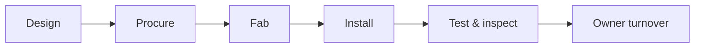

# Projects Hub — Active Portfolio Dashboard

Central landing for **job health**, **financial snapshot**, and **deep links** to each Git-backed project folder (`projects/<ProjectID>/`).

---

## Live portfolio — Power BI

<iframe
  title="Power BI — Active projects portfolio"
  src="https://app.powerbi.com/reportEmbed?reportId=REPLACE_PORTFOLIO_REPORT_ID&groupId=REPLACE_WORKSPACE_ID"
  width="100%"
  height="620"
  style="border:0;border-radius:8px;"
  loading="lazy"
  allowfullscreen>
</iframe>

---

## Active projects (sample table — sync from ERP)

| Job ID | Name | PM | Phase | Billing type | Health |
|--------|------|-----|-------|--------------|--------|
| TI-2026-045 | Downtown Office Renovation | A. Rivera | Field / test | Progress | Green |
| HC-2025-112 | Data Hall — Building C | J. Kim | Fab release | GMP | Yellow |
| SV-2026-008 | County Courthouse retrofit | M. Patel | Design | Lump sum | Green |

---

## Stage definitions

---

## Planner — portfolio actions

<iframe
  title="Planner — Cross-project actions"
  src="https://tasks.office.com/Home/PlanViews/REPLACE_PORTFOLIO_PLAN_ID/Embed"
  width="100%"
  height="540"
  style="border:0;border-radius:8px;"
  loading="lazy"
  allowfullscreen>
</iframe>

---

## Project page starter + sample

- **Blank starter (copy this):** duplicate **`projects/template-project/`** → `projects/<ProjectID>/`, then edit [Project home template](/projects/template-project/project-home).
- **Filled example:** [TI-2026-045 — Downtown Office Renovation](/projects/TI-2026-045/downtown-office-renovation).

### New project Git checklist

| Step | Action |
|------|--------|
| 1 | Copy `template-project/` → rename folder to `<ProjectID>` (matches ERP) |
| 2 | Replace `{{PROJECT_ID}}`, `{{CLIENT_SHORT}}`, `{{PROJECT_TITLE}}`, and other placeholders |
| 3 | Create document library root `/<ProjectID>-<ClientShort>/` — numbered `00_`–`07_`, alphabetical folders, plus **Invoices**, **Material Listing**, **Purchase Orders**, and `_QuickLinks/` if used — see [template](/projects/template-project/project-home) |
| 4 | Update Planner / Power BI embed URLs for the job |
| 5 | Link from this dashboard table |

---

*Navigation: [Home](/home) · [PMO](/departments/project-management/overview)*
