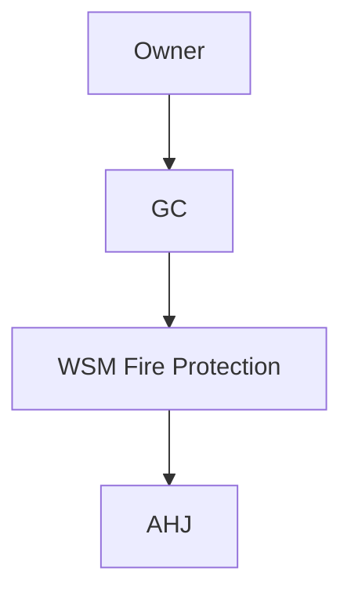

# {{PROJECT_ID}} — {{PROJECT_TITLE}}

**Owner:** {{OWNER}}  
**GC:** {{GC}}  
**Client short (folder suffix):** `{{CLIENT_SHORT}}` — use in document library root below  
**Contract:** {{CONTRACT_VALUE}}  
**PM:** {{PM}} · **Super:** {{SUPER}} · **PE:** {{PE}}  
**Jurisdiction:** {{AHJ}} + **NFPA** (edition) / **CBC** as adopted

---

## Project file & folder template (SharePoint / file share)

Use **one** job root: `/<ProjectID>-<ClientShort>/`. It combines (1) **numbered** folders for delivery / technical records, (2) **alphabetical** folders for commercial and pursuit work, and (3) optional **`_QuickLinks`**. The **wiki** stays under `projects/<ProjectID>/` in Git.

**Where “permits, inspections, submittals, RFIs, calculations” live:** use the **numbered** paths below—do **not** add duplicate top-level folders with the same purpose (e.g. no second `Permits` if you use `04_Permits_AHJ`).

```text
/{{PROJECT_ID}}-{{CLIENT_SHORT}}/

  # Numbered — delivery / technical (sorts first in Explorer)
  00_Admin_Contracts_Insurance/
  01_Design_Calcs_ShopDrawings/     ← calculations, hydraulic calcs, shop dwg support
  02_Submittals/
  03_RFIs_ChangeOrders/             ← RFIs + change orders
  04_Permits_AHJ/                   ← permits, AHJ correspondence
  05_Field_Site/
  06_Testing_Inspection/            ← inspections, test reports, witness sheets
  07_Closeout/

  # Alphabetical — commercial / pursuit / procurement
  Bid/
  Billing/                          ← pay apps, SOV, billing correspondence (not raw vendor invoices)
  Change Estimates/
  Contract/
  Drawings/
  Invoices/                         ← vendor + customer invoice PDFs, AP/AR backup, COI billing tie-ins
  Job Setup/
  Material Listing/               ← BOM, material logs, takeoff exports, procurement lists
  Prelien Info/
  Purchase Orders/                ← PO PDFs, PO registers, sub PO tracking
  Template Forms/

  _QuickLinks/                      ← optional: .url to wiki, Planner, Teams, Procore
```

| Folder | Typical contents |
|--------|------------------|
| `00_Admin_Contracts_Insurance` | Prime contract, subs, COIs, bonds, NOCs, notices |
| `01_Design_Calcs_ShopDrawings` | **Calculations**, shop drawings, BIM exports, design correspondence |
| `02_Submittals` | **Submittals**, approvals, product data |
| `03_RFIs_ChangeOrders` | **RFIs**, COs, PCOs, pricing backup |
| `04_Permits_AHJ` | **Permits**, applications, CORs, inspector correspondence |
| `05_Field_Site` | Site photos, daily reports, safety, laydown, ASIs |
| `06_Testing_Inspection` | **Inspections**, hydro / flow / main drain, test packages |
| `07_Closeout` | As-builts, O&M, training, warranties, lien releases |
| `Bid` | Pursuit / bid-stage files, addenda during bidding, pricing workpapers |
| `Billing` | Pay applications, billing letters (use **`Invoices`** for invoice PDFs) |
| `Change Estimates` | T&M, change estimates, CO pricing drafts |
| `Contract` | Executed contracts, COIs, bonds, executed COs |
| `Drawings` | Contract drawings, revisions, transmittals |
| `Invoices` | **Invoices** (vendor + customer copies), supporting scans for AP/AR |
| `Job Setup` | Kickoff, internal setup, insurance / compliance, job numbering |
| `Material Listing` | **Material listing** / BOM, material status exports |
| `Prelien Info` | Preliminary notices, prelien tracking, releases |
| `Purchase Orders` | **Purchase orders**, PO backups, receiving tie-ins |
| `Template Forms` | Job-specific company blank forms |
| `_QuickLinks` | Shortcuts to wiki page, Planner, Teams, PM tool |

**`{{CLIENT_SHORT}}`:** agreed abbreviation (often 3–5 chars), stable for the job—document it in the snapshot table so accounting and PM use the same root name.

---

## Project control room — Power BI (job-specific)

<div class="wiki-embed wiki-embed--powerbi">

<iframe
  title="Power BI — {{PROJECT_ID}} cost & schedule"
  src="https://app.powerbi.com/reportEmbed?reportId=REPLACE_JOB_REPORT_ID&groupId=REPLACE_WORKSPACE_ID&filter=Jobs/JobId eq '{{PROJECT_ID}}'"
  width="100%"
  height="600"
  style="border:0;border-radius:8px;"
  loading="lazy"
  allowfullscreen>
</iframe>

</div>

---

## One-page snapshot

| Attribute | Value |
|-----------|-------|
| Address | {{JOB_ADDRESS}} |
| Document root | `{{PROJECT_ID}}-{{CLIENT_SHORT}}` |
| System | {{SYSTEM_TYPE}} |
| Design density | {{DESIGN_DENSITY_REF}} |
| Permit # | {{PERMIT_NUMBER}} |
| AHJ inspector | {{INSPECTOR}} |
| Substantial completion | {{SUBSTANTIAL_COMPLETION}} |
| Liquidated damages | {{LD_TERMS}} |

---

## Scope highlights

- {{SCOPE_BULLET_1}}
- {{SCOPE_BULLET_2}}
- {{SCOPE_BULLET_3}}

---

## Master schedule (milestone view)

```mermaid
gantt
  title {{PROJECT_ID}} — Key milestones
  dateFormat  YYYY-MM-DD
  section Design
  Milestone 1           :m1, YYYY-MM-DD, 7d
  section Field
  Milestone 2           :m2, YYYY-MM-DD, 7d
```

---

## Cost & billing status

| Metric | Original | Current budget | Actual + commitments | Notes |
|--------|----------|----------------|----------------------|-------|
| Material | | | | |
| Labor field | | | | |
| Shop fab | | | | |
| Subcontracts | | | | |
| GS & fee | | | | |

---

## Open items / risk register

| ID | Risk | Impact | Mitigation | Owner |
|----|------|--------|------------|-------|
| R-01 | | | | |

---

## Submittals & RFIs (summary)

| Type | Submitted | Approved | Open |
|------|-----------|----------|------|
| | | | |

---

## Job Planner board (tasks)

<div class="wiki-embed wiki-embed--planner">

<iframe
  title="Microsoft Planner — {{PROJECT_ID}}"
  src="https://tasks.office.com/Home/PlanViews/REPLACE_JOB_PLAN_ID/Embed"
  width="100%"
  height="640"
  style="border:0;border-radius:8px;"
  loading="lazy"
  allowfullscreen>
</iframe>

</div>

---

## Testing & commissioning (planned)

| Test | System / portion | Target date | Witness |
|------|------------------|-------------|---------|
| | | | |

---

## Closeout package index

| Document | Status |
|----------|--------|
| As-builts | |
| O&M manuals | |
| Training | |
| Warranty | |

---

## Stakeholder map



---

## Quick links

| Resource | Link / location |
|----------|-----------------|
| ERP job | `{{PROJECT_ID}}` |
| Document library / job folder | `…/{{PROJECT_ID}}-{{CLIENT_SHORT}}/` |
| Procore / PM tool | |
| BIM 360 / ACC | |
| Job shared drive | |
| Wiki project page | Paste published URL here; also save a `.url` in `_QuickLinks/` |

---

*Starter page: copy this folder to `projects/<ProjectID>/`, replace placeholders, then add the job to [Projects dashboard](/projects/dashboard). Filled example: [TI-2026-045](/projects/TI-2026-045/downtown-office-renovation).*
