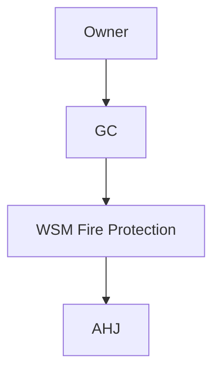

# {{PROJECT_ID}} — {{PROJECT_TITLE}}

**Owner:** {{OWNER}}  
**GC:** {{GC}}  
**Client short (folder suffix):** `{{CLIENT_SHORT}}` — use in document library root below  
**Contract:** {{CONTRACT_VALUE}}  
**PM:** {{PM}} · **Super:** {{SUPER}} · **PE:** {{PE}}  
**Jurisdiction:** {{AHJ}} + **NFPA** (edition) / **CBC** as adopted

---

## Project file & folder template (SharePoint / file share)

This matches the **company standard** for new jobs (Explorer / file share today; use the same names in SharePoint). Folders sort **alphabetically**—no numeric prefixes. The **wiki** stays under `projects/<ProjectID>/` in Git; the **file root** uses `/<ProjectID>-<ClientShort>/` so job folders stay unique.

```text
/{{PROJECT_ID}}-{{CLIENT_SHORT}}/
  Bid/
  Billing/
  Change Estimates/
  Contract/
  Drawings/
  Job Setup/
  Prelien Info/
  Template Forms/
  _QuickLinks/          ← optional: .url shortcuts to wiki, Planner, Teams, Procore
```

| Folder | Typical contents |
|--------|------------------|
| `Bid` | Pursuit / bid-stage files, addenda received during bidding, pricing workpapers |
| `Billing` | Applications, pay app backup, billing correspondence, lien-release support |
| `Change Estimates` | T&M, change estimates, CO pricing drafts before formal contract CO |
| `Contract` | Prime contract, subcontracts, COIs, bonds, executed change orders |
| `Drawings` | Contract drawings, revisions, shop drawing PDFs, design correspondence |
| `Job Setup` | Kickoff, internal job setup, insurance / compliance setup, job numbering |
| `Prelien Info` | Preliminary notices, prelien tracking, releases (as applicable) |
| `Template Forms` | Job-specific copies of company blank forms (if not centralized elsewhere) |
| `_QuickLinks` | Shortcut files to this wiki page, job Planner, Teams channel, PM tool |

**`{{CLIENT_SHORT}}`:** agreed abbreviation (often 3–5 chars), stable for the job—document it in the snapshot table so accounting and PM use the same root name.

*Field execution extras (daily reports, test sheets, closeout O&M) often land under **Contract** / **Drawings** / **Job Setup** or your PM tool—keep team rules consistent when you add SharePoint views or metadata.*

---

## Project control room — Power BI (job-specific)

<div class="wiki-embed wiki-embed--powerbi">

<iframe
  title="Power BI — {{PROJECT_ID}} cost & schedule"
  src="https://app.powerbi.com/reportEmbed?reportId=REPLACE_JOB_REPORT_ID&groupId=REPLACE_WORKSPACE_ID&filter=Jobs/JobId eq '{{PROJECT_ID}}'"
  width="100%"
  height="600"
  style="border:0;border-radius:8px;"
  loading="lazy"
  allowfullscreen>
</iframe>

</div>

---

## One-page snapshot

| Attribute | Value |
|-----------|-------|
| Address | {{JOB_ADDRESS}} |
| Document root | `{{PROJECT_ID}}-{{CLIENT_SHORT}}` |
| System | {{SYSTEM_TYPE}} |
| Design density | {{DESIGN_DENSITY_REF}} |
| Permit # | {{PERMIT_NUMBER}} |
| AHJ inspector | {{INSPECTOR}} |
| Substantial completion | {{SUBSTANTIAL_COMPLETION}} |
| Liquidated damages | {{LD_TERMS}} |

---

## Scope highlights

- {{SCOPE_BULLET_1}}
- {{SCOPE_BULLET_2}}
- {{SCOPE_BULLET_3}}

---

## Master schedule (milestone view)

```mermaid
gantt
  title {{PROJECT_ID}} — Key milestones
  dateFormat  YYYY-MM-DD
  section Design
  Milestone 1           :m1, YYYY-MM-DD, 7d
  section Field
  Milestone 2           :m2, YYYY-MM-DD, 7d
```

---

## Cost & billing status

| Metric | Original | Current budget | Actual + commitments | Notes |
|--------|----------|----------------|----------------------|-------|
| Material | | | | |
| Labor field | | | | |
| Shop fab | | | | |
| Subcontracts | | | | |
| GS & fee | | | | |

---

## Open items / risk register

| ID | Risk | Impact | Mitigation | Owner |
|----|------|--------|------------|-------|
| R-01 | | | | |

---

## Submittals & RFIs (summary)

| Type | Submitted | Approved | Open |
|------|-----------|----------|------|
| | | | |

---

## Job Planner board (tasks)

<div class="wiki-embed wiki-embed--planner">

<iframe
  title="Microsoft Planner — {{PROJECT_ID}}"
  src="https://tasks.office.com/Home/PlanViews/REPLACE_JOB_PLAN_ID/Embed"
  width="100%"
  height="640"
  style="border:0;border-radius:8px;"
  loading="lazy"
  allowfullscreen>
</iframe>

</div>

---

## Testing & commissioning (planned)

| Test | System / portion | Target date | Witness |
|------|------------------|-------------|---------|
| | | | |

---

## Closeout package index

| Document | Status |
|----------|--------|
| As-builts | |
| O&M manuals | |
| Training | |
| Warranty | |

---

## Stakeholder map



---

## Quick links

| Resource | Link / location |
|----------|-----------------|
| ERP job | `{{PROJECT_ID}}` |
| Document library / job folder | `…/{{PROJECT_ID}}-{{CLIENT_SHORT}}/` |
| Procore / PM tool | |
| BIM 360 / ACC | |
| Job shared drive | |
| Wiki project page | Paste published URL here; also save a `.url` in `_QuickLinks/` |

---

*Starter page: copy this folder to `projects/<ProjectID>/`, replace placeholders, then add the job to [Projects dashboard](/projects/dashboard). Filled example: [TI-2026-045](/projects/TI-2026-045/downtown-office-renovation).*
