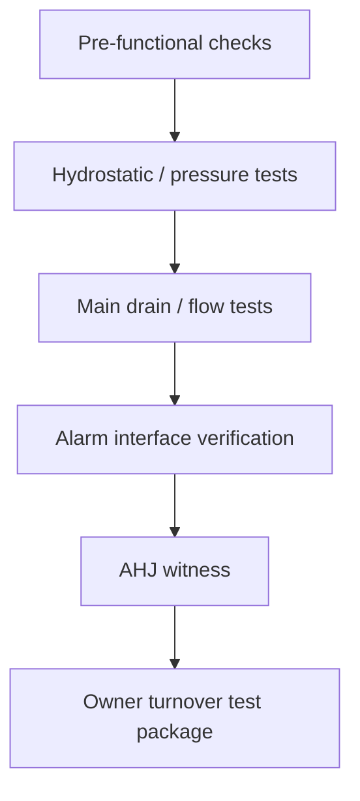

# Inspection, Testing & Commissioning Standard

Company standard for pre-functional checks, witness testing, AHJ readiness, and owner turnover testing documentation.

---

## Test sequence

---

## Standard test package

| Document | Required |
|----------|----------|
| Test report forms | Yes |
| Gauge calibration evidence | Yes |
| Punch list + closures | Yes |
| AHJ signoff record | Yes |
| Owner O&M/training record | Yes |

---

## Readiness checklist

| Item | Owner |
|------|-------|
| Approved drawings onsite | PM / Super |
| Access and escorts coordinated | PM |
| All deficiencies pre-closed | Field |
| Monitoring station coordination | PM / Service |

---

*Cross-links: [Field](/departments/field/overview) · [Service](/departments/service/overview)*