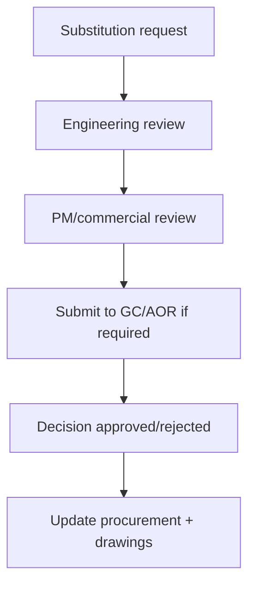

# Material Substitution Policy

Policy for requesting and approving material substitutions while preserving code compliance, design intent, and schedule reliability.

---

## Substitution criteria

| Criterion | Requirement |
|----------|-------------|
| Listing / approvals | Equivalent or superior listing |
| Hydraulic impact | Recalculation if required |
| Lead time benefit | Documented and meaningful |
| Cost impact | Transparent adder/credit |
| Warranty impact | No degradation |

---

## Approval workflow

---

## Required package

| Document | Required |
|----------|----------|
| Technical cut sheet comparison | Yes |
| Compliance statement | Yes |
| Schedule impact note | Yes |
| Cost impact statement | Yes |

---

*Cross-links: [Purchasing](/departments/purchasing/overview) · [Design](/departments/design/overview)*