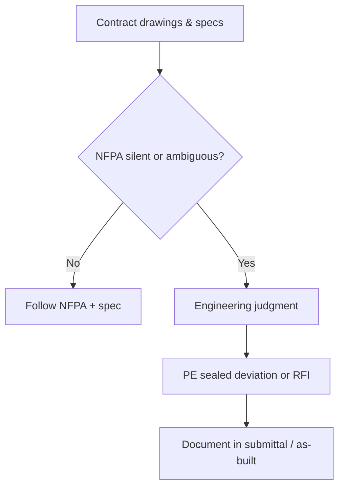

# Engineering & Installation Standards

Company **design criteria**, **installation tolerances**, and **code baseline** for **C-16 Fire Protection** work. This is the standards **hub**; detailed QA lists live in linked subpages.

---

## Code & standard baseline

| Document | Edition (confirm AHJ) | Application |
|----------|----------------------|-------------|
| NFPA 13 | 2022 / 2019 as adopted | Sprinkler system design & install |
| NFPA 14 | As adopted | Standpipe & hose systems |
| NFPA 20 | As adopted | Fire pumps |
| NFPA 25 | As adopted | Inspection, testing, maintenance |
| CBC / CFC | Current cycle | California building / fire code |

---

## Standard decision flow

---

## Company criteria (examples — edit to corporate standard)

| Topic | Company standard |
|-------|------------------|
| Head temperature rating | Match occupancy; **QR** in office open plan unless spec differs |
| Seismic bracing | NFPA 13 Chapter 18 + **project-specific** calc |
| Corrosion | Internal lining / stainless policy per water quality memo |
| Above-ceiling access | Maintain **clearance** per architect + maintenance |

---

## Live standards adoption dashboard (Power BI)

<iframe
  title="Power BI — QA findings by standard clause"
  src="https://app.powerbi.com/reportEmbed?reportId=REPLACE_STANDARDS_REPORT_ID&groupId=REPLACE_WORKSPACE_ID"
  width="100%"
  height="480"
  style="border:0;border-radius:8px;"
  loading="lazy"
  allowfullscreen>
</iframe>

---

## Design QA checklist

Use the detailed page: **[NFPA design QA checklist](/standards/nfpa-design-qa-checklist)**

## Expanded standards library

| Standard page | Link |
|---------------|------|
| California compliance matrix | [California code compliance matrix](/standards/california-code-compliance-matrix) |
| Inspection, testing, commissioning | [ITC standard](/standards/inspection-testing-commissioning) |
| QA/QC punch and turnover | [QA/QC punch & turnover](/standards/qaqc-punch-and-turnover) |
| Material substitutions | [Material substitution policy](/standards/material-substitution-policy) |

---

## Planner — code update reviews

<iframe
  title="Planner — Code cycle updates"
  src="https://tasks.office.com/Home/PlanViews/REPLACE_PLANNER_PLAN_ID/Embed"
  width="100%"
  height="480"
  style="border:0;border-radius:8px;"
  loading="lazy"
  allowfullscreen>
</iframe>

---

*Cross-links: [Design](/departments/design/overview) · [Field](/departments/field/overview) · [Shop SOP](/departments/shop/fabrication-procedures)*
