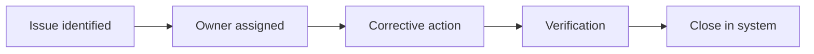

# QA/QC Punch & Turnover Standard

Defines quality checkpoints from fabrication through final turnover to reduce post-handover callbacks.

---

## QA/QC control points

| Phase | Control point |
|------|---------------|
| Design | Peer QA checklist complete |
| Shop | First article and batch checks |
| Field rough-in | Above-ceiling pre-close photos |
| Final | Labeling, signage, test tags, documentation |

---

## Punch close process

---

## Turnover package

| Item | Status |
|------|--------|
| As-built drawings | Required |
| O&M manuals | Required |
| Warranty letter | Required |
| Training attendance record | Required |
| Final signed test report | Required |

---

*Cross-links: [Project management](/departments/project-management/overview) · [Templates lessons learned](/templates/template-lessons-learned)*