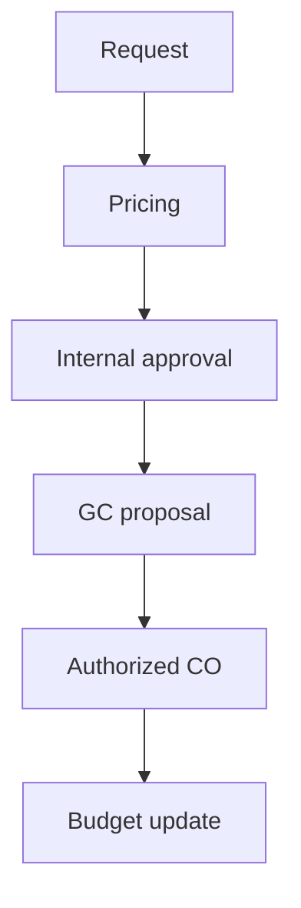

# Template — Change Order Summary (CO)

Use for **internal** CO packages before formal GC pricing — keeps **scope, cost, and schedule** aligned.

---

## Ready-to-use page body (copy fence)

````markdown
# Change Order {{CO_NUMBER}} — {{SHORT_TITLE}}

**Project:** {{JOB_ID}} — {{PROJECT_NAME}}  
**Initiated by:** {{REQUESTOR}} · **Date:** {{DATE}}  
**GC / owner ref:** {{REFERENCE_NUMBER}}

## Scope narrative

{{DESCRIPTION_OF_ADDED_OR_DELETED_WORK}}

## Basis for pricing

| Element | Source |
|---------|--------|
| Drawings / sketches | {{LIST}} |
| RFIs | {{LIST}} |
| Field verification | {{WHO}} on {{DATE}} |

## Quantities

| Code | Description | QTY | UOM | Unit $ | Extended $ |
|------|-------------|-----|-----|--------|------------|
| {{CODE}} | {{DESC}} | {{Q}} | {{UOM}} | {{$}} | {{$}} |

## Labor hours (burdened)

| Task | Crew | Hours | Rate | $ |
|------|------|-------|------|---|
| {{TASK}} | {{CREW}} | {{H}} | {{R}} | {{$}} |

## Subcontracts / equipment

| Vendor | Scope | $ |
|--------|-------|---|
| {{V}} | {{S}} | {{$}} |

## Schedule impact

| Milestone | Original | Revised | Δ |
|-----------|----------|---------|---|
| {{MS}} | {{DATE}} | {{DATE}} | {{DAYS}} |

## Pricing summary

| | Amount |
|--|--------|
| Direct cost subtotal | {{$}} |
| OH & profit @ {{%}} | {{$}} |
| **Total CO** | **{{$}}** |

## Risk / exclusions

- {{ITEM}}

## Approvals

| Role | Name | Signature / date |
|------|------|------------------|
| Estimator | {{}} | {{}} |
| PM | {{}} | {{}} |
| Exec (if > ${{}}) | {{}} | {{}} |
````

---

## Mermaid — CO workflow


