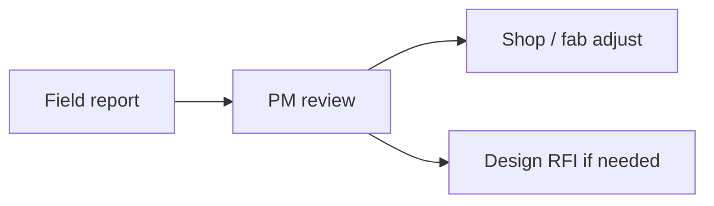

# Template — Field Daily Report (FDR)

Standard **daily field report** for superintendents / foremen. Paste into job folder or Procore companion page.

---

## Ready-to-use page body (copy fence)

````markdown
# Field Daily Report — {{DATE}}

**Project:** {{JOB_ID}} — {{PROJECT_NAME}}  
**Reporter:** {{NAME}} · **Weather:** {{WEATHER}} · **High temp:** {{TEMP}}

## Crew & hours

| Craft | Qty | ST | OT | Job # / phase |
|-------|-----|----|----|----------------|
| Sprinkler fitter | {{N}} | {{H}} | {{H}} | {{PHASE}} |
| Apprentice | {{N}} | {{H}} | {{H}} | {{PHASE}} |

## Work performed

| Area / grid | Scope completed | % of plan |
|-------------|-----------------|-----------|
| {{AREA}} | {{DESCRIPTION}} | {{%}} |

## Equipment / deliveries

| Item | Qty | Vendor | Notes |
|------|-----|--------|-------|
| {{ITEM}} | {{QTY}} | {{VENDOR}} | {{NOTES}} |

## Inspections / tests

- {{NONE_OR_LIST}}

## Visitors / meetings

- {{LIST}}

## Safety

| Observation | Severity | Action |
|-------------|----------|--------|
| {{OBS}} | {{L/M/H}} | {{ACTION}} |

## Constraints / delays

- **Cause:** {{CAUSE}}  
- **Notice:** {{Y/N}} · **Hours lost:** {{HRS}}

## Look-ahead tomorrow

- {{BULLET}}
- {{BULLET}}

## Photos

- `{{FILE_OR_LINK_1}}`
- `{{FILE_OR_LINK_2}}`

---

*Signed: {{NAME}} · {{TIME}}*
````

---

## Mermaid — daily feedback loop


