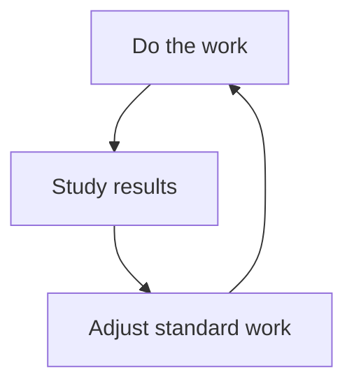

# Template — Lessons Learned / After Action Review (AAR)

Run at **major milestones** or **job closeout** to feed **estimating**, **design**, and **standard work**.

---

## Ready-to-use page body (copy fence)

````markdown
# Lessons Learned — {{JOB_ID}} — {{PROJECT_NAME}}

**Facilitator:** {{NAME}} · **Date:** {{DATE}}  
**Attendees:** {{LIST_ROLES}}

## Project facts

| Metric | Planned | Actual | Δ |
|--------|---------|--------|---|
| Duration | {{}} | {{}} | {{}} |
| Gross margin % | {{}} | {{}} | {{}} |
| Rework hours | {{}} | {{}} | {{}} |
| RFIs | {{}} | {{}} | {{}} |

## What was supposed to happen?

{{PLAN_SUMMARY}}

## What actually happened?

{{REALITY_SUMMARY}}

## Why was there a gap? (5 Whys optional)

1. {{WHY_1}}
2. {{WHY_2}}
3. {{WHY_3}}

## What worked well (keep)

- {{BULLET}}
- {{BULLET}}

## What to improve (change)

| Issue | Root cause | Countermeasure | Owner | Due |
|-------|------------|----------------|-------|-----|
| {{I}} | {{RC}} | {{CM}} | {{O}} | {{D}} |

## Knowledge to capture in wiki / standards

- [ ] Update {{PAGE_OR_SOP}}
- [ ] Add detail to {{ESTIMATE_NORM}}

## Follow-up review date

**{{DATE}}**
````

---

## Mermaid — learning loop


