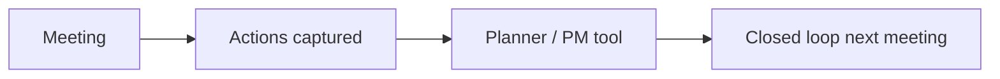

# Template — OAC / Internal Meeting Notes

Copy the **code block below** into a new wiki page (or Git Markdown file). Replace placeholders in `{{DOUBLE_BRACES}}`.

---

## Ready-to-use page body (copy everything inside the fence)

````markdown
# {{MEETING_TITLE}} — {{DATE}}

**Project:** {{JOB_ID}} — {{PROJECT_NAME}}  
**Meeting type:** {{OAC / Internal / Owner / AHJ}}  
**Time / location:** {{TIME}} · {{LOCATION_OR_LINK}}

## Attendees

| Name | Company | Role |
|------|---------|------|
| {{NAME}} | {{CO}} | {{ROLE}} |

## Agenda

1. {{ITEM}}
2. {{ITEM}}
3. {{ITEM}}

## Discussion summary

| Topic | Decision / note | Owner | Due |
|-------|-----------------|-------|-----|
| {{TOPIC}} | {{NOTE}} | {{OWNER}} | {{DATE}} |

## RFIs / submittals referenced

- {{RFI_OR_SUB_NUMBER}} — {{ONE_LINE_SUMMARY}}

## Risks / constraints

- {{RISK}} — **Mitigation:** {{MITIGATION}}

## Next meeting

**Date:** {{DATE}}  
**Focus:** {{TOPICS}}

---

*Recorder: {{NAME}} · Distributed: {{DATE}}*
````

---

## Optional Mermaid — action item flow


