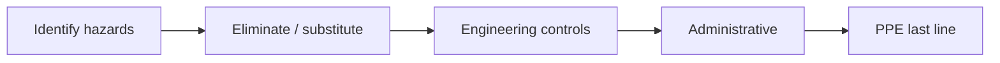

# Template — Pre-Job Safety Briefing (JSA / PTP)

**Job safety analysis** / **pre-task plan** for sprinkler work — use at **crew start** or **significant task change**.

---

## Ready-to-use page body (copy fence)

````markdown
# Pre-Job Safety Briefing — {{DATE}}

**Project:** {{JOB_ID}} — {{PROJECT_NAME}}  
**Work location:** {{FLOOR_GRID}}  
**Foreman / GF:** {{NAME}} · **Safety rep:** {{NAME}}

## Task description

{{WHAT_WE_ARE_DOING_TODAY}}

## Hazards & controls

| Hazard | Risk | Control measures | Responsible |
|--------|------|------------------|-------------|
| Falls from elevation | Serious / fatal | 100% tie-off, guardrails, hole covers | {{NAME}} |
| Struck-by / caught-in | Serious | Exclusion zone, tagline, spotter | {{NAME}} |
| Eye / face (cutting, grinding) | Moderate | Z87+ eyewear, face shield | All |
| Hearing | Chronic | Hearing protection > 85 dBA | All |
| Material handling | Strain / crush | Mechanical lift, team lift plan | {{NAME}} |
| Hot work (if any) | Fire | Hot work permit, fire watch | {{NAME}} |

## Emergency

| Item | Detail |
|------|--------|
| Nearest hospital | {{NAME / ADDRESS}} |
| Assembly point | {{LOCATION}} |
| GC emergency contact | {{PHONE}} |

## Lift / equipment (if used)

| Unit | Inspection OK | Operator card verified |
|------|-----------------|------------------------|
| {{LIFT_ID}} | {{Y/N}} | {{Y/N}} |

## Tools & PPE check

- [ ] Correct tools for task
- [ ] GFCI / cords inspected
- [ ] Fire extinguisher accessible (within {{FT}} ft)

## Crew sign-in

| Print name | Signature |
|------------|-----------|
| {{NAME}} | |
| {{NAME}} | |

---

*Briefing led by: {{NAME}} · Time: {{TIME}}*
````

---

## Mermaid — hazard control loop


