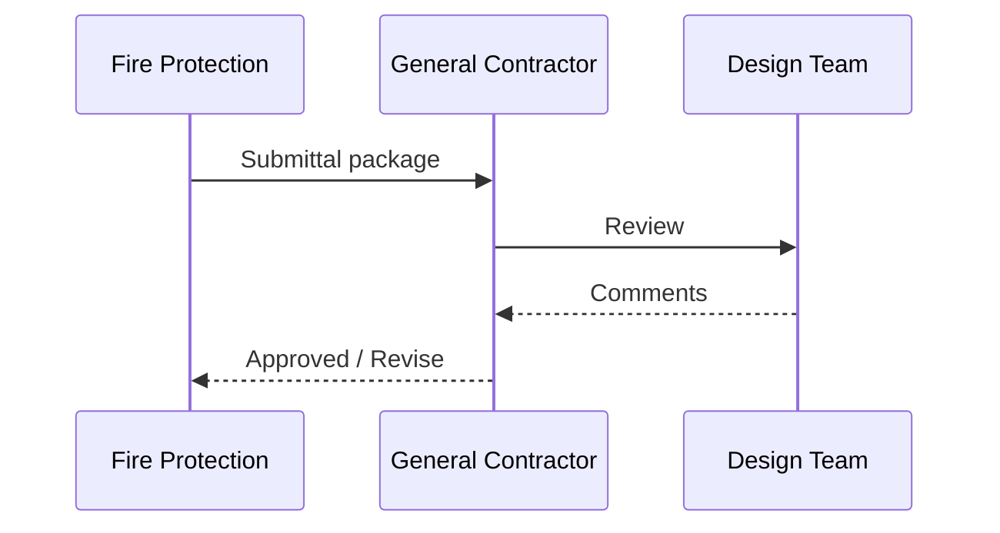

# Template — RFI & Submittal Log Entry

Use for consistent **RFI** and **submittal** rows in the wiki or when creating a standalone log page per job.

---

## Ready-to-use table row block (copy fence)

````markdown
### {{ENTRY_TYPE}} — {{NUMBER}}

| Field | Value |
|-------|-------|
| **Project** | {{JOB_ID}} |
| **Spec / drawing ref** | {{SECTION}} · {{DWG_REV}} |
| **Subject** | {{SHORT_TITLE}} |
| **Submitted** | {{DATE}} |
| **Required by** | {{DATE}} |
| **Submitted by** | {{NAME}} |
| **Status** | {{Open / Answered / Closed}} |
| **Ball-in-court** | {{COMPANY}} |

**Description:**  
{{DETAILED_DESCRIPTION}}

**Proposed solution:**  
{{PROPOSED}}

**Attachments:**  
{{LINKS_OR_FILE_NAMES}}

**Impact:** {{Cost}} · {{Schedule}} · {{None}}

**Response (when received):**  
{{RESPONSE_TEXT}}
````

---

## Ready-to-use combined log table (copy fence)

````markdown
## {{JOB_ID}} — RFI / Submittal index

| ID | Type | Subject | Submitted | Due | Status | Ball |
|----|------|---------|-----------|-----|--------|------|
| RFI-118 | RFI | Ceiling zone CL-15 | 2026-03-10 | 2026-03-17 | Open | Architect |
| SUB-044 | Sub | Fusible link kit | 2026-03-08 | 2026-03-22 | Review | GC |
````

---

## Mermaid — submittal workflow


